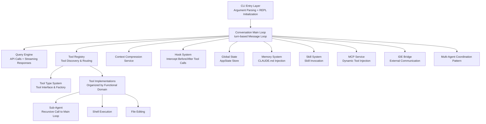
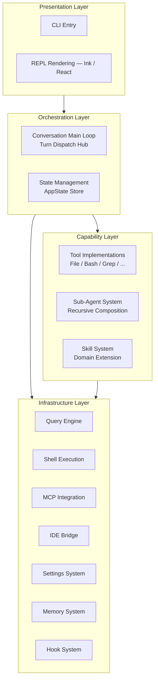
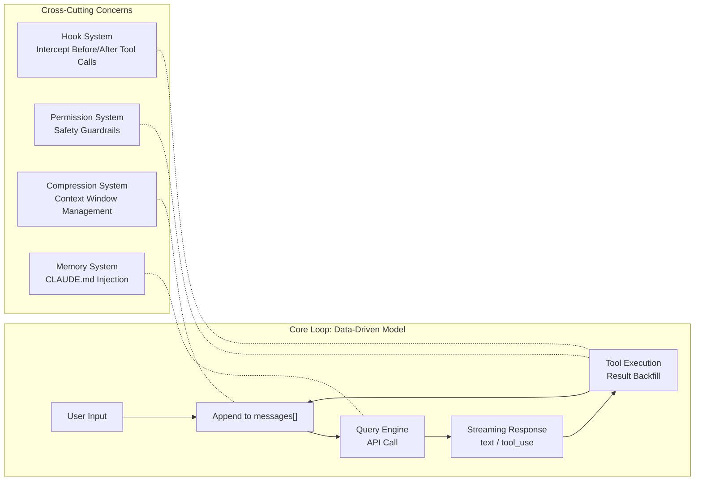

<Info>
  Use this map as your starting point when exploring the Claude Code source code. The module index (A.1) tells you where to look; the data flow diagrams (A.3) show you how data moves through the system; the design pattern table (A.5) explains the architectural intent.
</Info>

## How to use this map

- **First-time read**: work through A.1 → A.2 → A.3 in order to build a holistic picture
- **Finding a module**: jump directly to the A.1 index table, then follow the chapter reference
- **Tracing a feature**: find its flow path in A.3
- **Understanding coupling**: see the coupling analysis in A.2.3
- **Design intent**: consult the pattern reference in A.5

---

## A.1 Core module index

All 16 core modules, their responsibilities, key data structures, and the chapters that discuss them in depth.

<CardGroup cols={2}>
  <Card title="CLI Entry & REPL" icon="terminal">
    Command-line entry point. Parses argument flags, initializes the REPL interaction loop, and renders output via the Ink/React component tree. Delegates all business logic to the Orchestration Layer.

    **Key structures**: CLI argument object, REPL rendering state tree

    **Chapter**: 2
  </Card>
  <Card title="Conversation Main Loop" icon="repeat">
    Turn-based dispatch hub. Manages the full cycle of user input → model inference → tool execution → result backfill for each turn. The heart of the system.

    **Key structures**: `messages[]` (Message[]), turn counter, stop reason state

    **Chapter**: 2
  </Card>
  <Card title="Query Engine" icon="database">
    Encapsulates all Anthropic Messages API communication: system prompt assembly, streaming response parsing, token counting, cache strategy, and retry logic.

    **Key structures**: API request config, content blocks (ContentBlock[]), cache breakpoint markers

    **Chapter**: 2, 13
  </Card>
  <Card title="Tool Type System" icon="wrench">
    Defines the standard interface all tools must implement: `isEnabled`, `isReadOnly`, `isConcurrencySafe`, `isDestructive`, `checkPermissions`, and more. The contract layer for the entire tool ecosystem.

    **Key structures**: Tool interface definitions, Zod input schemas, tool description templates

    **Chapter**: 3
  </Card>
  <Card title="Tool Registry" icon="list">
    Global tool registration, discovery, and assembly. Merges built-in tools with MCP dynamic tools at runtime, sorts by name, and deduplicates (built-in tools take priority on name conflicts).

    **Key structures**: `Map<name, Tool>`, registered tool list

    **Chapter**: 3
  </Card>
  <Card title="Sub-Agent System" icon="sitemap">
    Spawns, forks, recovers, and manages sub-agents. Implements recursive agent composition — an agent can fork independent sub-task executors with isolated contexts.

    **Key structures**: Sub-agent config, fork state snapshot, agent recovery context

    **Chapter**: 8, 9
  </Card>
  <Card title="Shell Execution Engine" icon="code">
    Validates shell command permissions, detects read-only commands, and provides secure sandboxed execution. Handles command injection prevention, timeout management, and output truncation.

    **Key structures**: Command execution request, output streams (stdout/stderr), exit status code

    **Chapter**: 3, 4
  </Card>
  <Card title="Context Compression" icon="compress">
    Multi-layer compression: auto-compact, micro-compact, history snip, and context collapse. Triggers automatically when context approaches the token limit to keep conversations uninterrupted.

    **Key structures**: Compression summary messages, token usage counts, compression threshold config

    **Chapter**: 7
  </Card>
  <Card title="Hook System" icon="webhook">
    Pre/post tool-use hooks and session lifecycle hooks. Provides extension points across the full lifecycle without modifying core code.

    **Key structures**: Hook registry, hook execution context, hook output results

    **Chapter**: 8
  </Card>
  <Card title="Settings System" icon="sliders">
    Three-tier configuration (global / project / local) with permission rule definitions and Zod schema validation. Uses a layered overlay model for flexibility and auditability.

    **Key structures**: Three-tier Settings objects, permission rule arrays, Zod validation schemas

    **Chapter**: 5
  </Card>
  <Card title="Memory System" icon="brain">
    Discovers CLAUDE.md files at global, project, directory, and team levels. Injects relevant memory into the system prompt at the start of each turn for cross-session knowledge persistence.

    **Key structures**: Memory files (CLAUDE.md), memory hierarchy tree, relevance matching scores

    **Chapter**: 6
  </Card>
  <Card title="Skill System" icon="puzzle-piece">
    Manages built-in skills, dynamic loading, and slash command registration. Skills are installable capability packages that expand the agent's domain-specific expertise.

    **Key structures**: Skill registry, slash command mapping, skill prompt templates

    **Chapter**: 11
  </Card>
  <Card title="MCP Integration" icon="plug">
    Complete Model Context Protocol client: connection management, protocol adaptation, resource read/write, and permission channels. Allows external tool servers to provide context and callable tools.

    **Key structures**: MCP connection config, resource descriptors, tool capability declarations

    **Chapter**: 12
  </Card>
  <Card title="IDE Bridge" icon="bridge">
    Bidirectional communication with VS Code and JetBrains plugins via JWT-authenticated protocol. Supports permission callback pipelines and remote session management.

    **Key structures**: Bridge message queue, JWT token, IDE state snapshot

    **Chapter**: 7
  </Card>
  <Card title="Coordinator Pattern" icon="network-wired">
    Hub for multi-agent collaboration. Distributes tasks to workers, tracks progress, and integrates results. Used in `COORDINATOR_MODE`.

    **Key structures**: Worker registry, task queue, result aggregation state

    **Chapter**: 10
  </Card>
  <Card title="State Management" icon="server">
    Centralized global application state store with React integration and the selector pattern for efficient subscriptions. Provides reactive state updates to the Presentation Layer.

    **Key structures**: Global state tree (AppState), selector functions, state update events

    **Chapter**: 2, 13
  </Card>
</CardGroup>

---

## A.2 Module dependency relationships

### Core dependency chain



### A.2.1 Four-layer architecture



<Tabs>
  <Tab title="Presentation Layer">
    Contains the CLI entry point and REPL rendering module. Uses the Ink framework (React-based) to render the component tree as terminal text output. Responsible for user input capture, output rendering, keyboard shortcuts, and theme switching.

    **Dependency direction**: depends only on the Orchestration Layer.

    **Modules**: CLI Entry, REPL
  </Tab>
  <Tab title="Orchestration Layer">
    Contains the conversation main loop and state management. The main loop is the dispatch hub coordinating the query engine, tool registry, and compression service. State management maintains the global AppState tree.

    **Core invariant**: turn completeness — each turn must complete the full cycle of model call → tool execution → result backfill → call again.

    **Modules**: Conversation Main Loop, State Management
  </Tab>
  <Tab title="Capability Layer">
    Contains all tool implementations, the sub-agent system, and the skill system. Each tool is an independent capability unit. The sub-agent system achieves nested execution by recursively calling the Orchestration Layer's main loop.

    **Dependency direction**: depends on the Infrastructure Layer.

    **Modules**: Tool Implementations, Sub-Agent System, Skill System
  </Tab>
  <Tab title="Infrastructure Layer">
    Provides the most fundamental technical capabilities without business logic: API communication, shell execution, external protocol integration, configuration, memory, and hooks.

    **Dependency direction**: does not depend on upper layers; can be called by any module above.

    **Modules**: Query Engine, Shell Execution, MCP Integration, IDE Bridge, Settings System, Memory System, Hook System
  </Tab>
</Tabs>

### A.2.2 Core loop — the data-driven model

Claude Code does not use traditional imperative flow control. Instead it drives execution through continuous appending to the `messages[]` array. The input for each turn is an ever-growing messages array; each model inference makes decisions based on its complete contents.



### A.2.3 Inter-module coupling analysis

| Coupling relationship | Degree | Description |
|---|---|---|
| Conversation Main Loop ↔ Query Engine | **Tight** | Main loop directly depends on the query engine's streaming output interface; both share the messages array data model |
| Conversation Main Loop ↔ Tool Registry | **Tight** | Tool dispatch is a core main loop responsibility; tool routing logic is embedded in turn handling |
| Tool Registry ↔ MCP Integration | **Loose** | MCP tools integrate through dynamic registration, discovered and loaded on demand at runtime |
| Sub-Agent ↔ Conversation Main Loop | **Recursive** | Sub-agents achieve nested execution by recursively calling the main loop — a self-similar fractal structure |
| Hook System ↔ Tool Execution | **Event** | Hooks are triggered through lifecycle events without affecting the core tool execution path |
| Memory System ↔ Query Engine | **Loose** | Memory content is injected as part of the system prompt; no direct participation in API call logic |
| Settings System ↔ All modules | **Configuration** | Settings influence nearly all module behavior via config objects, but modules have no direct dependencies on each other |

---

## A.3 Data flow paths

Six key data flows through Claude Code. Each flow annotates the modules and decision points involved.

<Tabs>
  <Tab title="Standard tool call">

    The most fundamental flow. All other paths are variations or subsets of this core loop.

    ```mermaid
    flowchart TD
        A["[1] User Input"]
        B["[2] Conversation Main Loop: processUserMessage()\nAppend user message to messages[]\nInject CLAUDE.md memory content"]
        C["[3] Query Engine: queryAPI()\nAssemble system prompt + messages + tools\nCall Anthropic Messages API (streaming)"]
        D["[4] Streaming Response Processing\nProgressively receive text and tool_use blocks\nRender to REPL terminal"]
        E{"[5] Tool Routing\nLook up tool instance / Zod schema validation\nPermission check"}
        F["[6] Tool Execution\nPreToolUse hook → Actual tool execution → PostToolUse hook"]
        G["[7] Result Backfill\ntool_result appended to messages[]\nLarge results persisted to disk"]
        H{"[8] Loop Decision\nstop_reason === end_turn?"}
        I["[9] Turn Complete\nOutput final text response\nCheck if auto-compact is needed"]
        J["[10] Wait for next user input"]
        A --> B --> C --> D --> E
        E -->|tool_use| F --> G --> H
        H -->|No, continue loop| C
        H -->|Yes, end| I --> J
    ```

    **Key decision points**:
    - Step [5]: the most important security decision point — determines whether a tool is executed
    - Step [7]: large result persistence prevents a single tool result from filling the token window
    - Step [8]: `stop_reason` is the only mechanism to exit the loop
  </Tab>
  <Tab title="Permission decision">

    Every tool call must pass through this full decision chain before it can execute.

    ```mermaid
    flowchart TD
        A["Tool Call Request"]
        B["[1] Input Legality Validation\nZod schema validation"]
        C{"Validation Passed?"}
        D["[2] Tool-Level Permission Logic\ncheckPermissions() — returns allow / deny / ask"]
        E["[3] PreToolUse Hook\nUser-defined hooks — can continue / modify params / block"]
        F["[4] General Permission System\nalwaysAllow / alwaysDeny / alwaysAsk\nPermission mode check"]
        G{"[5] Classifier-Assisted Decision\nTranscript Classifier / Bash Classifier"}
        H["Execute Tool"]
        I["Deny Execution"]
        J["[6] PostToolUse Hook\nPost-execution — log recording / result validation"]
        A --> B --> C
        C -->|Failed| I
        C -->|Passed| D --> E --> F --> G
        G -->|allow| H --> J
        G -->|deny| I
    ```

    **Permission mode interaction**:

    | Mode | Policy | Experience |
    |---|---|---|
    | `ask` (default) | All write operations require user confirmation | Most secure, frequent interaction |
    | `auto-edit` | File edits auto-approved; other writes still confirmed | Balanced security and efficiency |
    | `full-auto` | All operations execute automatically (subject to alwaysDeny) | Smoothest; highest risk |
    | `plan` | Only read-only tools allowed | Safe plan review before execution |
  </Tab>
  <Tab title="Context compression">

    Claude Code's core strategy for handling context window limitations.

    ```mermaid
    flowchart TD
        A["Conversation Main Loop Turn Complete"]
        B{"[1] Check Token Usage\nNear threshold (80%–90%)?"}
        C["[2] Trigger Compression Strategy Selection"]
        C1["micro-compact\nLightweight compression, fast reduction"]
        C2["auto-compact (standard)\nFull compression, API generates summary"]
        C3["history snip\nIntelligent trimming of processed history"]
        C4["context collapse\nMost aggressive folding (experimental)"]
        D["[3] Execute Compression\nGroup history into units\nCall API to generate summary\nReplace original messages with summary"]
        E["[4] Post-Compression\nVerify token usage within safe range\nUpdate messages[] array"]
        F["[5] Resume Main Loop\nCompressed messages[] as input"]
        A --> B
        B -->|Not near threshold| F
        B -->|Near threshold| C
        C --> C1 --> D
        C --> C2 --> D
        C --> C3 --> D
        C --> C4 --> D
        D --> E --> F
    ```

    | Strategy | Flag | Intensity | Cache-friendly |
    |---|---|---|---|
    | micro-compact | `CACHED_MICROCOMPACT` | Light | Yes |
    | auto-compact | `REACTIVE_COMPACT` | Medium | Partial |
    | history snip | `HISTORY_SNIP` | Medium-high | No |
    | context collapse | `CONTEXT_COLLAPSE` | Extreme | No |
  </Tab>
  <Tab title="Memory injection">

    How cross-session knowledge from CLAUDE.md enters each conversation turn.

    ```mermaid
    flowchart TD
        A["[1] Session Start / Turn Begin"]
        B["[2] Memory Discovery\nSearch for CLAUDE.md files level by level\nGlobal / Project / Directory / Team"]
        C["[3] Relevance Matching\nScore memory fragments for relevance\nEvaluate match with current context"]
        D["[4] Memory Injection\nInject selected memories into system prompt\nSort by priority, truncate if over budget"]
        E["[5] Memory Takes Effect\nInjected content active in current turn's model inference"]
        A --> B --> C --> D --> E
    ```

    **CLAUDE.md hierarchy** (highest to lowest priority):
    1. Global: `~/.claude/CLAUDE.md`
    2. Project root: `<project>/.claude/CLAUDE.md`
    3. Directory-level: `<subdir>/CLAUDE.md`
    4. Team: synced via `TEAMMEM` feature flag
  </Tab>
  <Tab title="MCP registration">

    How external tool servers dynamically extend the tool registry at runtime.

    ```mermaid
    flowchart TD
        A["[1] MCP Connection Initialization\nRead server list\nEstablish connections + protocol handshake"]
        B["[2] Tool Discovery\nQuery server tool list\nGet input schemas and descriptions\nAdapt to internal tool interface"]
        C["[3] Tool Registration\nAdd MCP tools to tool registry\nMerge with built-in tools, sort, deduplicate\nBuilt-in tools win on name conflicts"]
        D["[4] Runtime Invocation\ntool_use follows same routing flow\nForward to MCP server via protocol channel\nResult backfilled into message array"]
        E["[5] Connection Lifecycle\nAuto-reconnect on disconnect\nClean up resources at session end"]
        A --> B --> C --> D --> E
    ```
  </Tab>
  <Tab title="Sub-agent fork">

    How agents create isolated sub-task executors with independent contexts.

    ```mermaid
    flowchart TD
        A["[1] Parent Agent Decides to Fork\nModel decides to create sub-agent for subtask\nTriggered via AgentTool fork"]
        B["[2] Fork Context Creation\nCopy message history as initial context\nInherit permission rules and settings\nSub-agent gets independent messages array"]
        C["[3] Sub-Agent Independent Execution\nRecursively call conversation main loop\nExecute tool calls in independent context\nSupports nested forks (depth-limited)"]
        D["[4] Result Collection\nSub-agent result backfilled into parent messages[]\nTemporary resources cleaned up"]
        E["[5] Resume Parent Execution\nContinue from fork point\nSub-agent context releases token budget"]
        A --> B --> C --> D --> E
    ```
  </Tab>
</Tabs>

---

## A.4 Module interface contracts

| Contract | Input | Output | Guarantee |
|---|---|---|---|
| Main Loop → Query Engine | System prompt, messages[], tool list, model params | Streaming content blocks (text or tool_use) | Query engine handles retries, stream parsing, error recovery; main loop only processes block semantics |
| Main Loop → Tool Registry | Tool name | Tool instance | Registry returns matching tool or null |
| Tool Registry → Tool | Tool instance + input params | Structured result | Tool executes and returns a result conforming to the tool result schema |
| Permission Interface | Tool instance + input params | `allow` / `deny` / `ask` | Decision is deterministic given the same permission mode and rules |
| Hook System | Lifecycle event + context object | Modified context or block signal | Hooks cannot crash the core path; errors are isolated |

**Tool interface protocol** — all tools must implement:

| Method | Returns | Description |
|---|---|---|
| `isEnabled()` | boolean | Whether the tool is enabled in the current context |
| `isReadOnly()` | boolean | Whether the tool only performs read operations |
| `isConcurrencySafe()` | boolean | Whether the tool can be safely executed in parallel |
| `isDestructive()` | boolean | Whether the tool performs irreversible operations |
| `checkPermissions()` | `allow` / `deny` / `ask` | Tool-level permission decision |
| `toAutoClassifierInput()` | string | Feature description for automatic classification |
| `userFacingName()` | string | User-friendly name |

---

## A.5 Design pattern quick reference

Ten key design patterns employed across the Claude Code architecture:

| Pattern | Location | Design intent |
|---|---|---|
| **Agent Loop** | Conversation main loop | Combines LLM inference with tool execution into an iterative loop until task completion |
| **Factory Method** | Tool type system | Creates tool instances through a unified factory, ensuring all tools follow the same interface |
| **Registry** | Tool registry, skill registry | Registers and looks up capability units by name; supports runtime dynamic extension |
| **Plugin** | MCP integration, skill system | Allows external modules to extend capabilities without modifying core code |
| **Observer** | Hook system | Registers observers on lifecycle events; achieves loosely coupled cross-cutting concerns |
| **Strategy** | Context compression | Multiple compression strategies are interchangeable; optimal strategy selected based on context |
| **Layered Architecture** | Overall system | Clear layering: Presentation → Orchestration → Capability → Infrastructure |
| **Async Generator** | Query engine, streaming output | `async function*` progressively yields streaming results; naturally supports backpressure |
| **Hierarchical Agent** | Sub-agent system | Hierarchical agent composition via fork; forms fractal structures |
| **Feature Flag** | System-wide | Boolean switches injected at compile time; enables dead code elimination and progressive rollout |

---

## Navigation guide: which module to look at

| Question | Start here |
|---|---|
| How does a user message become a model call? | Conversation Main Loop → Query Engine |
| How is a tool invoked and executed? | Tool Registry → Tool Type System → specific tool impl |
| How is execution permission decided? | Permission Decision Path (A.3) → Settings System |
| Why did context get compressed? | Context Compression module → A.3 compression flow |
| How does CLAUDE.md affect the model? | Memory System → Memory Injection Path (A.3) |
| How are MCP tools registered? | MCP Integration → MCP Registration Path (A.3) |
| How do sub-agents work? | Sub-Agent System → Sub-Agent Fork Path (A.3) |
| Where are hooks triggered? | Hook System → A.4 hook lifecycle contracts |
| Where is configuration loaded? | Settings System (three-tier layered model) |
| How does the IDE plugin communicate? | IDE Bridge → Bridge Mode feature flag |
| How does multi-agent coordination work? | Coordinator Pattern → Chapter 10 |
| Why is a tool missing at runtime? | Tool Registry → Appendix B enablement conditions |
