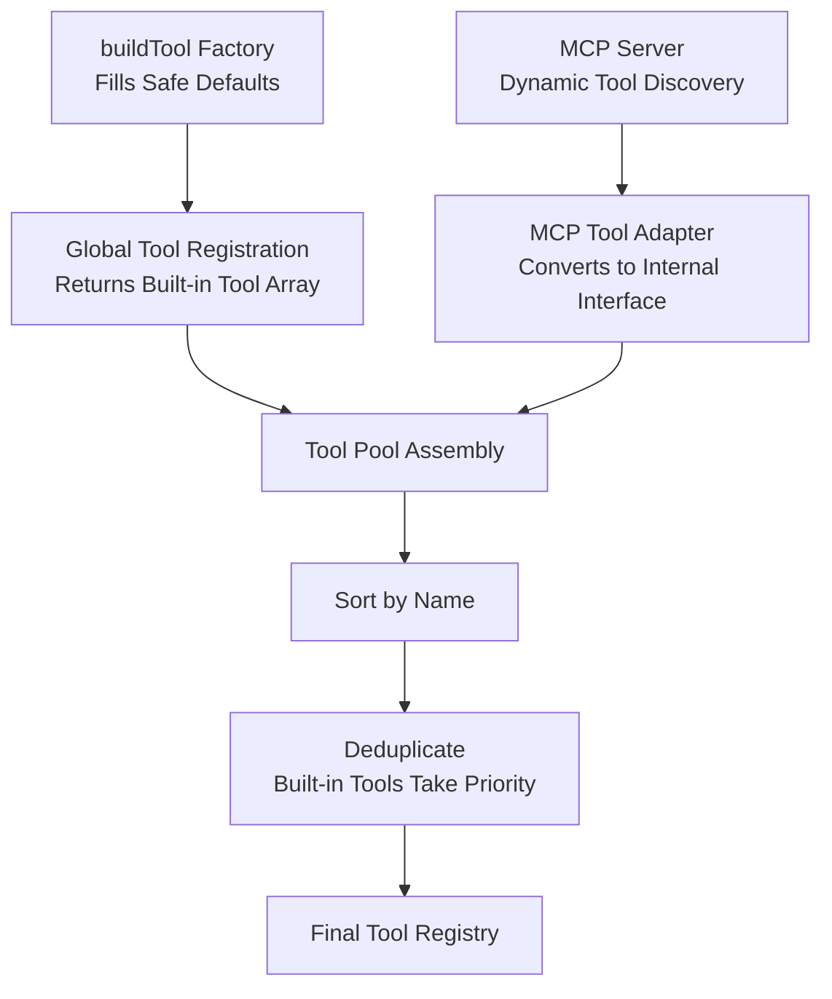

<Info>
  Tools are the fundamental capability units through which the agent interacts with the external world. Each tool is registered in the tool registry via a unified interface protocol and dispatched by the conversation main loop.
</Info>

## Permission model field definitions

| Field | Meaning |
|---|---|
| `readOnly` | Tool only reads; does not modify the file system or external state. Read-only tools can run in plan mode and have more relaxed permission constraints. |
| `destructive` | Tool performs irreversible operations (deletion, overwriting, sending). Undergoes stricter scrutiny during permission checks. |
| `concurrencySafe` | Tool can be safely executed in parallel (no dependency on shared mutable state). Concurrency-safe tools can be dispatched simultaneously by the streaming tool executor. |

`true`/`false` indicates a fixed value. `dynamic` indicates runtime determination based on input parameters. Methods not explicitly overridden use `buildTool` defaults (all `false`).

<Note>
  For tool attribute protocol details, see [Architecture Navigation Map — A.4.3](/appendix/a-architecture-map#a43-standard-protocol-of-the-tool-type-system). For conditional enablement, see the [enablement conditions table](#tool-enablement-conditions) below.
</Note>

---

## 1. File operations

The complete file operation chain from reading to editing to creation.

| Tool | `readOnly` | `destructive` | `concurrencySafe` | Description |
|---|:---:|:---:|:---:|---|
| `FileReadTool` | `true` | `false` | `true` | Reads file content; supports line number ranges, PDF pagination, images, and notebook formats |
| `FileWriteTool` | `false` | `false` | `false` | Writes files, overwriting existing content or creating new files |
| `FileEditTool` | `false` | `false` | `false` | Precise string-replacement editing; supports single-instance and global (`replace_all`) replacement |
| `NotebookEditTool` | `false` | `false` | `false` | Edits Jupyter Notebook cells — replace, insert, or delete cells |

**Typical workflow**: `FileReadTool` → analyze → `FileEditTool` / `FileWriteTool`. Read first to confirm current state, then decide between precise editing or a full rewrite.

---

## 2. Search

File name search and content search complement each other, covering the full range from structural positioning to semantic lookup.

| Tool | `readOnly` | `destructive` | `concurrencySafe` | Description |
|---|:---:|:---:|:---:|---|
| `GlobTool` | `true` | `false` | `true` | File name glob pattern matching; results sorted by modification time |
| `GrepTool` | `true` | `false` | `true` | Regex-based content search powered by ripgrep; supports `files_with_matches`, `content`, and `count` output modes |
| `ToolSearchTool` | `false` | `false` | `false` | Keyword-based tool discovery for lazily-loaded tools; conditionally enabled by `ToolSearch` flag |

**Recommended strategies**:
- Exploring an unfamiliar project → `GlobTool` first to understand file structure, then `GrepTool` for key symbols
- Locating specific code → `GrepTool` content mode is most efficient
- Measuring code scale → `GrepTool` count mode combined with `GlobTool` file list

---

## 3. Execution

The bridge between the agent and the operating system. Nearly all command-line operations go through `BashTool`.

| Tool | `readOnly` | `destructive` | `concurrencySafe` | Description |
|---|:---:|:---:|:---:|---|
| `BashTool` | `dynamic` | `false` | `dynamic` | Shell command execution. Read-only commands run in parallel; write commands run serially. Permission dynamically determined from command content. |
| `PowerShellTool` | `dynamic` | `false` | `dynamic` | Windows PowerShell execution. Conditionally replaces `BashTool` in Windows environments. Functionally equivalent. |

**Special mechanisms**:
- **Read-only detection**: `BashTool` maintains an internal list of read-only commands (`ls`, `cat`, `git status`, etc.); matched commands are marked `readOnly`
- **Parallel execution**: when multiple `BashTool` calls are all `concurrencySafe`, the streaming tool executor dispatches them simultaneously
- **Timeout management**: long-running commands have a timeout to prevent indefinite blocking
- **Output truncation**: output exceeding the limit is truncated and the remainder persisted to disk

---

## 4. Network

Two complementary approaches to accessing internet information.

| Tool | `readOnly` | `destructive` | `concurrencySafe` | Description |
|---|:---:|:---:|:---:|---|
| `WebFetchTool` | `true` | `false` | `true` | Fetches a URL and converts the content to markdown |
| `WebSearchTool` | `true` | `false` | `true` | Performs a web search and returns structured results (titles, summaries, links) |

**Combined pattern**: use `WebSearchTool` for a broad search first, then `WebFetchTool` to deeply retrieve specific page content.

---

## 5. Agent

Implements Claude Code's recursive composition capability: creating sub-agents, cross-agent communication, and multi-agent teams.

| Tool | `readOnly` | `destructive` | `concurrencySafe` | Description |
|---|:---:|:---:|:---:|---|
| `AgentTool` | `false` | `false` | `false` | Launches sub-agents (built-in or custom); supports fork, resume, and background execution |
| `SendMessageTool` | `dynamic` | `false` | `false` | Sends messages to other agents or channels; plain text messages are `readOnly` |
| `TeamCreateTool` | `false` | `false` | `false` | Creates a multi-agent team (conditionally enabled: Agent Swarms mode) |
| `TeamDeleteTool` | `false` | `false` | `false` | Deletes a created team |

---

## 6. Task management

Complete lifecycle management for background tasks: creation, inspection, monitoring, and termination.

| Tool | `readOnly` | `destructive` | `concurrencySafe` | Description |
|---|:---:|:---:|:---:|---|
| `TaskCreateTool` | `false` | `false` | `false` | Creates a background task (conditionally enabled: Todo V2) |
| `TaskGetTool` | `true` | `false` | `true` | Gets details of a single task |
| `TaskUpdateTool` | `false` | `false` | `false` | Updates task status or content |
| `TaskListTool` | `true` | `false` | `true` | Lists all tasks |
| `TaskOutputTool` | `dynamic` | `false` | `dynamic` | Gets task output stream; `concurrencySafe` when `readOnly` |
| `TaskStopTool` | `false` | `false` | `true` | Stops a running task |

**Typical workflow**: `TaskCreateTool` → `TaskListTool` → `TaskGetTool` → `TaskOutputTool` → `TaskStopTool`

---

## 7. Plan

Safe planning capabilities before execution.

| Tool | `readOnly` | `destructive` | `concurrencySafe` | Description |
|---|:---:|:---:|:---:|---|
| `EnterPlanModeTool` | `true` | `false` | `true` | Enters plan mode; restricts the agent to the read-only tool set |
| `ExitPlanModeV2Tool` | `true` | `false` | `true` | Exits plan mode; restores normal tool permissions |

<Note>
  In plan mode the agent can only use read-only tools (`FileReadTool`, `GrepTool`, etc.) for information gathering. No modification operations are permitted. Use this to design plans and assess risks before executing complex changes.
</Note>

---

## 8. Worktree

File-system-level isolation for parallel tasks via git worktree.

| Tool | `readOnly` | `destructive` | `concurrencySafe` | Description |
|---|:---:|:---:|:---:|---|
| `EnterWorktreeTool` | `false` | `false` | `false` | Creates a git worktree and switches the working directory (conditionally enabled: Worktree Mode) |
| `ExitWorktreeTool` | `false` | `false` | `false` | Exits the worktree, preserving or removing the working directory |

Suitable for avoiding file conflicts when multiple sub-agents handle different tasks in parallel, or when working on different branches simultaneously.

---

## 9. Scheduling

Time-driven automation capabilities.

| Tool | `readOnly` | `destructive` | `concurrencySafe` | Description |
|---|:---:|:---:|:---:|---|
| `CronCreateTool` | `false` | `false` | `false` | Creates a cron scheduled task using standard cron expressions (conditionally enabled: `AGENT_TRIGGERS`) |
| `CronDeleteTool` | `false` | `false` | `false` | Deletes a cron scheduled task |
| `CronListTool` | `true` | `false` | `true` | Lists all cron scheduled tasks |
| `RemoteTriggerTool` | `dynamic` | `false` | `false` | Remote trigger management (conditionally enabled: `AGENT_TRIGGERS_REMOTE`) |

---

## 10. Interaction

Manages the agent's interactions with users and system components.

| Tool | `readOnly` | `destructive` | `concurrencySafe` | Description |
|---|:---:|:---:|:---:|---|
| `AskUserQuestionTool` | `true` | `false` | `true` | Asks the user a question and waits for a reply |
| `SkillTool` | `false` | `false` | `false` | Invokes a registered slash command skill |
| `ConfigTool` | `dynamic` | `false` | `false` | Runtime configuration viewing / modification (ant build only) |

---

## 11. MCP

Resource access interface for the Model Context Protocol client.

| Tool | `readOnly` | `destructive` | `concurrencySafe` | Description |
|---|:---:|:---:|:---:|---|
| `ListMcpResourcesTool` | `true` | `false` | `true` | Lists resources provided by MCP servers |
| `ReadMcpResourceTool` | `true` | `false` | `true` | Reads a specific resource on an MCP server |

Both tools are read-only and concurrency-safe. `ListMcpResourcesTool` discovers available external resources; `ReadMcpResourceTool` reads specific resource content.

---

## 12. Other

| Tool | `readOnly` | `destructive` | `concurrencySafe` | Description |
|---|:---:|:---:|:---:|---|
| `TodoWriteTool` | `false` | `false` | `false` | Todo panel writer; UI-linked, results not rendered to transcript |
| `BriefTool` | `false` | `false` | `true` | Controls output brevity mode |
| `LSPTool` | `true` | `false` | `true` | Language Server Protocol operations (conditionally enabled: `ENABLE_LSP_TOOL`) |
| `SleepTool` | `false` | `false` | `false` | Delayed wait (conditionally enabled: `PROACTIVE` / `KAIROS`) |
| `TungstenTool` | `false` | `false` | `false` | Internal tool (ant build only) |
| `SyntheticOutputTool` | `true` | `false` | `true` | Synthetic output tool (internal infrastructure) |
| `SnipTool` | `false` | `false` | `false` | History message trimming (conditionally enabled: `HISTORY_SNIP`) |
| `MonitorTool` | `false` | `false` | `false` | Background task output monitoring (conditionally enabled: `MONITOR_TOOL`) |
| `WorkflowTool` | `false` | `false` | `false` | Workflow script execution (conditionally enabled: `WORKFLOW_SCRIPTS`) |
| `ListPeersTool` | `false` | `false` | `false` | Lists peer agents (conditionally enabled: `UDS_INBOX`) |
| `REPLTool` | `false` | `false` | `false` | REPL wrapper; provides Bash / Read / Edit in a VM (ant build only) |
| `SuggestBackgroundPRTool` | `false` | `false` | `false` | Suggests background PR creation (ant build only) |
| `WebBrowserTool` | `false` | `false` | `false` | Built-in browser panel (conditionally enabled: `WEB_BROWSER_TOOL`) |
| `SendUserFileTool` | `false` | `false` | `false` | Sends a file to the user (conditionally enabled: `KAIROS`) |
| `PushNotificationTool` | `false` | `false` | `false` | Push notification (conditionally enabled: `KAIROS`) |
| `SubscribePRTool` | `false` | `false` | `false` | PR webhook subscription (conditionally enabled: `KAIROS_GITHUB_WEBHOOKS`) |
| `CtxInspectTool` | `false` | `false` | `false` | Context inspector (conditionally enabled: `CONTEXT_COLLAPSE`) |
| `TerminalCaptureTool` | `false` | `false` | `false` | Terminal screenshot capture (conditionally enabled: `TERMINAL_PANEL`) |
| `VerifyPlanExecutionTool` | `false` | `false` | `false` | Plan execution verification (conditionally enabled: `CLAUDE_CODE_VERIFY_PLAN`) |
| `OverflowTestTool` | `false` | `false` | `false` | Overflow scenario simulation (internal testing only) |
| `TestingPermissionTool` | `true` | `false` | `true` | Permission testing tool (`NODE_ENV=test` only) |

---

## Tool enablement conditions

Tools conditionally enabled through feature flags or environment variables:

| Condition | Enabled tools | Chapter |
|---|---|:---:|
| `USER_TYPE === 'ant'` | `ConfigTool`, `TungstenTool`, `REPLTool`, `SuggestBackgroundPRTool` | — |
| `PROACTIVE` / `KAIROS` | `SleepTool` | 5 |
| `AGENT_TRIGGERS` | `CronCreateTool`, `CronDeleteTool`, `CronListTool` | 9 |
| `AGENT_TRIGGERS_REMOTE` | `RemoteTriggerTool` | 9 |
| `MONITOR_TOOL` | `MonitorTool` | 7 |
| `KAIROS` | `SendUserFileTool`, `PushNotificationTool` | 6 |
| `KAIROS_GITHUB_WEBHOOKS` | `SubscribePRTool` | 6 |
| `ENABLE_LSP_TOOL` | `LSPTool` | 7 |
| `WORKFLOW_SCRIPTS` | `WorkflowTool` | 9 |
| `HISTORY_SNIP` | `SnipTool` | 4 |
| `UDS_INBOX` | `ListPeersTool` | 7 |
| `WEB_BROWSER_TOOL` | `WebBrowserTool` | 7 |
| `CONTEXT_COLLAPSE` | `CtxInspectTool` | 4 |
| `TERMINAL_PANEL` | `TerminalCaptureTool` | 12 |
| `COORDINATOR_MODE` | Additionally enables `AgentTool`, `TaskStopTool`, `SendMessageTool` | 8 |
| `Todo V2` | `TaskCreateTool`, `TaskGetTool`, `TaskUpdateTool`, `TaskListTool` | — |
| `Agent Swarms` | `TeamCreateTool`, `TeamDeleteTool` | 8 |
| `Worktree Mode` | `EnterWorktreeTool`, `ExitWorktreeTool` | 9 |
| `CLAUDE_CODE_SIMPLE` | Simplified mode retains only `BashTool`, `FileReadTool`, `FileEditTool` | — |
| `ToolSearch` | `ToolSearchTool` | 3 |
| `CLAUDE_CODE_VERIFY_PLAN` | `VerifyPlanExecutionTool` | 14 |

---

## Tool registration flow

All tools are created through a unified `buildTool` factory function, which fills in safe default values for any methods not explicitly defined:

| Method | Default |
|---|---|
| `isEnabled()` | `true` |
| `isReadOnly()` | `false` |
| `isConcurrencySafe()` | `false` |
| `isDestructive()` | `false` |
| `checkPermissions()` | `allow` |
| `toAutoClassifierInput()` | `""` (empty string) |
| `userFacingName()` | tool name |



---

## Common tool composition patterns

<AccordionGroup>
  <Accordion title="Pattern 1: Code exploration and understanding" icon="magnifying-glass">
    ```
    GlobTool → GrepTool → FileReadTool
    ```
    Use `GlobTool` to locate the file structure, `GrepTool` to search for key symbols, then `FileReadTool` to read the specific code.
  </Accordion>
  <Accordion title="Pattern 2: Code modification" icon="pen-to-square">
    ```
    FileReadTool → FileEditTool → BashTool (test)
    ```
    Read the target file first, use `FileEditTool` for precise modification, then run tests with `BashTool` to verify.
  </Accordion>
  <Accordion title="Pattern 3: Information research" icon="globe">
    ```
    WebSearchTool → WebFetchTool → FileWriteTool
    ```
    Search for related information, retrieve specific page content, then compile the results to a file.
  </Accordion>
  <Accordion title="Pattern 4: Multi-task parallelism" icon="diagram-project">
    ```
    AgentTool fork → [Sub-agent 1, Sub-agent 2, Sub-agent N] → Result aggregation
    ```
    Fork multiple sub-agents through `AgentTool`; each processes its subtask independently. The parent agent aggregates results.
  </Accordion>
  <Accordion title="Pattern 5: Safe planning" icon="shield">
    ```
    EnterPlanModeTool → Read-only tool set → ExitPlanModeV2Tool → Execution tool set
    ```
    Enter plan mode for safe analysis; exit and begin execution only after planning is complete.
  </Accordion>
  <Accordion title="Pattern 6: External resource integration" icon="plug">
    ```
    MCP connection init → ListMcpResourcesTool → ReadMcpResourceTool → Local tool processing
    ```
    Access external resources through MCP tools, then process them with local tools.
  </Accordion>
</AccordionGroup>

---

## Tool performance characteristics

| Category | Typical latency | Token consumption | Parallelism | Notes |
|---|---|---|---|---|
| File read | Low (local I/O) | Medium (depends on file size) | High — all concurrency-safe | Large file output is truncated |
| File write | Low (local I/O) | Low | None | Read and confirm before writing |
| File edit | Low (local I/O) | Low | None | Requires exact match of original string |
| Search (Glob/Grep) | Low (local) | Medium (depends on result volume) | High — all concurrency-safe | Result limits prevent token overflow |
| Bash execution | Variable | Variable | Read-only commands can run in parallel | Long-running commands have timeout |
| Network | High (network latency) | Medium (depends on page content) | High — all concurrency-safe | Significantly affected by network conditions |
| Sub-agent | High (recursive API calls) | High (independent context) | High (independent execution) | Note nesting depth limits |
| MCP operations | Medium (IPC) | Medium (depends on resource) | Depends on MCP server | Connection state affects availability |
