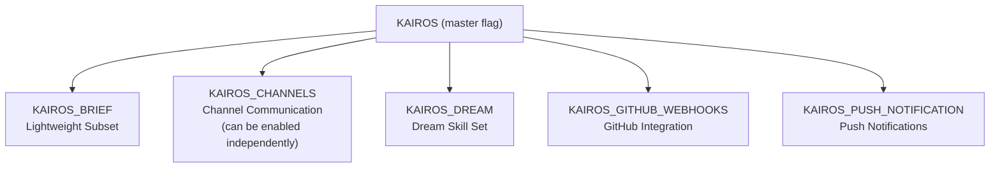
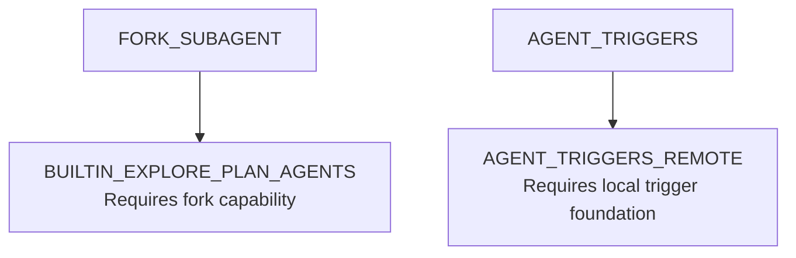
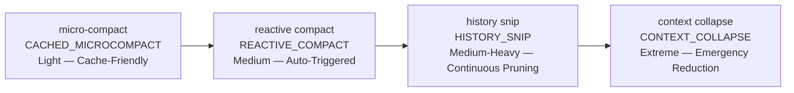

Feature flags are the core mechanism for compile-time dead code elimination in Claude Code. All flags are injected as boolean values by the Bun bundler during the build phase. When a flag is `false`, the code branch it guards is removed entirely from the output artifact — reducing binary size and protecting unreleased features.

## Flag types

<CardGroup cols={2}>
  <Card title="Compile-time" icon="hammer">
    The flag is evaluated during the Bun bundling phase. Code branches that resolve to `false` are completely absent from the output artifact. The flag has no runtime overhead.
  </Card>
  <Card title="Compile-time + Runtime Gating" icon="toggle-on">
    The flag is `true` at compile time (code is included in the artifact), but additional runtime conditions — such as environment variables or server-side configuration — must also be satisfied to activate the feature.
  </Card>
</CardGroup>

<Note>
  The "Dependencies" column lists prerequisite flags. A flag with dependencies will have no effect (or produce undefined behavior) if the prerequisite flag is not also enabled. Cross-reference with [Appendix B — Tool Enablement Conditions](/appendix/b-tool-inventory#tool-enablement-conditions) for the specific tools each flag enables.
</Note>

---

## C.1 Core interaction mode flags

Controls the primary operating modes of Claude Code and how it interacts with users, IDEs, and other systems.

| Flag | Type | Description | Dependencies | Chapter |
|---|---|---|---|:---:|
| `PROACTIVE` | Compile-time | Proactive mode. Agent can proactively offer suggestions and execute background tasks during user idle periods. Enables `SleepTool` and background task triggers. | None | 5 |
| `KAIROS` | Compile-time + Runtime | IDE-oriented channel-based collaboration (formerly Harbor). Enables channel messaging, session recovery, `SleepTool`, `SendUserFileTool`, `PushNotificationTool`, and the full assistant feature set. | None (sub-features have their own flags) | 6 |
| `KAIROS_BRIEF` | Compile-time | KAIROS lightweight subset. Enables session recovery and basic interaction only; does not include full channel functionality. | KAIROS context | 6 |
| `KAIROS_CHANNELS` | Compile-time + Runtime | Channel functionality toggle. Can be enabled independently of the full KAIROS feature set. Enables sending, receiving, and routing of channel messages. | Can be enabled independently | 6 |
| `KAIROS_DREAM` | Compile-time | KAIROS Dream mode. Loads and registers Dream-specific skill sets. | `KAIROS` | 6 |
| `KAIROS_GITHUB_WEBHOOKS` | Compile-time | GitHub Webhook integration in KAIROS mode. Enables `SubscribePRTool` and GitHub event listening and routing. | `KAIROS` | 6 |
| `KAIROS_PUSH_NOTIFICATION` | Compile-time | KAIROS push notification capability. Enables `PushNotificationTool` notification logic. | `KAIROS` | 6 |
| `BRIDGE_MODE` | Compile-time + Runtime | IDE bridge mode. REPL communicates with VS Code or JetBrains via a bridging protocol; supports permission callback pipelines and JWT authentication. | Requires an IDE plugin | 7 |
| `COORDINATOR_MODE` | Compile-time + Runtime | Coordinator mode. Acts as a task-distributing hub in multi-agent scenarios. Extends `AgentTool`, `TaskStopTool`, and `SendMessageTool` with coordinator behavior. | None | 8 |
| `VOICE_MODE` | Compile-time | Voice mode. Enables voice input/output, push-to-talk key bindings, and voice integration modules. | Microphone and speaker hardware | 12 |
| `DAEMON` | Compile-time | Background daemon mode. Allows Claude Code to run long-term as a daemon process with persistent services and a scheduled task framework. | None | 11 |
| `BUDDY` | Compile-time | Companion Sprite. Displays an interactive animated character in the REPL interface, providing emotional feedback via an animation state machine. | None | 12 |

**KAIROS flag family**:

---

## C.2 Agent and subtask flags

Controls task decomposition, scheduling, and automated execution capabilities.

| Flag | Type | Description | Dependencies | Chapter |
|---|---|---|---|:---:|
| `FORK_SUBAGENT` | Compile-time | Fork sub-agent. Allows creating independent sub-agents within a conversation via a fork mechanism. Enables `AgentTool` fork capability and sub-agent context isolation. | None | 8 |
| `AGENT_TRIGGERS` | Compile-time | Agent triggers. Enables scheduled task dispatch (cron) and periodic background agent execution. Enables `CronCreateTool`, `CronDeleteTool`, `CronListTool`. | `DAEMON` or long-running environment | 9 |
| `AGENT_TRIGGERS_REMOTE` | Compile-time | Remote agent triggers. Supports execution of remotely hosted scheduled triggers. Enables `RemoteTriggerTool`. | `AGENT_TRIGGERS` | 9 |
| `ULTRAPLAN` | Compile-time | Ultra-planning mode. Provides an interactive planning dialog for reviewing and modifying execution plans for complex tasks. Enhances `EnterPlanModeTool` / `ExitPlanModeV2Tool`. | None | 5 |
| `VERIFICATION_AGENT` | Compile-time | Verification agent. Automatically initiates a verification process after task completion; generates verification result reports. | None | 8 |
| `BUILTIN_EXPLORE_PLAN_AGENTS` | Compile-time | Built-in explore-plan agents. Provides pre-installed `ExploreAgent` and `PlanAgent` sub-agent definitions. | `FORK_SUBAGENT` | 8 |
| `AGENT_MEMORY_SNAPSHOT` | Compile-time | Agent memory snapshot. Supports snapshotting and restoring agent state across sessions. | None | 10 |
| `WORKFLOW_SCRIPTS` | Compile-time | Workflow scripts. Enables local workflow task processors supporting automated script orchestration. Enables `WorkflowTool`. | None | 9 |
| `TEMPLATES` | Compile-time | Template system. Enables the Job Classifier for identifying and routing different types of user requests. | None | 9 |

**Agent flag dependencies**:

---

## C.3 Context management and compression flags

Together these form a multi-layer compression strategy system, ranging from preventive lightweight compression to emergency aggressive pruning.

| Flag | Type | Description | Dependencies | Chapter |
|---|---|---|---|:---:|
| `REACTIVE_COMPACT` | Compile-time + Runtime | Reactive compression. Automatically triggers context compression when tokens approach the threshold, without waiting for user confirmation. | None | 4 |
| `CONTEXT_COLLAPSE` | Compile-time | Context collapse. More aggressive than traditional compression; includes a dedicated collapse UI and content recovery mechanism. Enables `CtxInspectTool`. | None | 4 |
| `CACHED_MICROCOMPACT` | Compile-time | Cached micro-compaction. Maintains prompt cache boundaries during micro-compaction to avoid cache invalidation overhead. | Prompt Cache API support | 4 |
| `HISTORY_SNIP` | Compile-time | History pruning (Snip Compact). Intelligently prunes processed conversation history while retaining key information. Enables `SnipTool`. | None | 4 |
| `COMPACTION_REMINDERS` | Compile-time | Compression reminders. Displays pre- and post-compression user notification UI. | Compression operations active | 4 |
| `PROMPT_CACHE_BREAK_DETECTION` | Compile-time | Prompt cache break detection. Detects and reports prompt cache boundary breaks during compression operations. | Compression operations active | 4 |
| `TOKEN_BUDGET` | Compile-time | Token budget manager. Tracks and visualizes token usage budgets; provides budget overrun warnings. | None | 4 |
| `COMMIT_ATTRIBUTION` | Compile-time | Commit attribution. Adds pre- and post-compression context attribution markers to code commits after compression. | Compression operations active | 4 |

**Compression strategy spectrum** (light → heavy):

| Strategy | Flag | Intensity | Cache-friendly | Applicable scenario |
|---|---|---|---|---|
| micro-compact | `CACHED_MICROCOMPACT` | Light | High | Preventive compression when approaching the threshold |
| reactive compact | `REACTIVE_COMPACT` | Medium | Medium | Automatically triggered standard compression |
| history snip | `HISTORY_SNIP` | Medium-heavy | Low | Intelligent pruning of history messages |
| context collapse | `CONTEXT_COLLAPSE` | Extreme | Low | Aggressive reduction in emergency situations |

<Tip>
  Enable `REACTIVE_COMPACT` + `CACHED_MICROCOMPACT` + `TOKEN_BUDGET` together for the best context management experience: preventive protection, cache preservation, and budget visualization.
</Tip>

---

## C.4 Permission and security flags

Defines the Claude Code trust model and controls autonomous execution boundaries and security auditing.

| Flag | Type | Description | Dependencies | Chapter |
|---|---|---|---|:---:|
| `TRANSCRIPT_CLASSIFIER` | Compile-time | Transcript classifier. Automatically determines permission mode (including auto mode) based on conversation content, replacing purely manual permission switching. | None | 3 |
| `BASH_CLASSIFIER` | Compile-time | Bash classifier. Performs ML-based security classification on Bash commands; high-confidence safe commands can be automatically approved. | None | 3 |
| `HARD_FAIL` | Compile-time | Hard fail mode. Terminates directly on critical errors rather than degrading gracefully. Useful for surfacing bugs during development. | None | 3 |
| `NATIVE_CLIENT_ATTESTATION` | Compile-time | Native client attestation. Enables platform-native client identity verification mechanisms. | Platform security framework | 3 |
| `ANTI_DISTILLATION_CC` | Compile-time | Anti-distillation protection. Prevents model outputs from being used for model distillation attacks via output watermarking. | None | 3 |

**Security level combinations**:

| Level | Recommended combination |
|---|---|
| Maximum (enterprise) | `TRANSCRIPT_CLASSIFIER` + `BASH_CLASSIFIER` + `HARD_FAIL` + `NATIVE_CLIENT_ATTESTATION` + `ANTI_DISTILLATION_CC` |
| Standard | `TRANSCRIPT_CLASSIFIER` + `BASH_CLASSIFIER` |
| Development debugging | `HARD_FAIL` only |

---

## C.5 Tool and skill flags

Controls the extensibility of available tools and advanced tool behaviors.

| Flag | Type | Description | Dependencies | Chapter |
|---|---|---|---|:---:|
| `MONITOR_TOOL` | Compile-time | Monitor tool. Provides monitoring capability when BashTool executes background tasks. Enables `MonitorTool`. | None | 7 |
| `WEB_BROWSER_TOOL` | Compile-time | Web browser tool. Enables the built-in browser panel supporting web browsing and content extraction. Enables `WebBrowserTool`. | None | 7 |
| `MCP_SKILLS` | Compile-time | MCP skill discovery. Allows dynamic discovery and loading of skills from MCP servers. | MCP connection | 7 |
| `EXPERIMENTAL_SKILL_SEARCH` | Compile-time | Experimental skill search. Enables semantic-based skill indexing and search. | None | 7 |
| `SKILL_IMPROVEMENT` | Compile-time | Skill improvement. Supports automatic optimization and iteration of installed skills. | Skill system | 7 |
| `RUN_SKILL_GENERATOR` | Compile-time | Skill generator runner. Supports dynamic generation of new skills. Enables skill generation workflow. | Skill system | 7 |
| `BUILDING_CLAUDE_APPS` | Compile-time | Claude app building mode. Loads a dedicated skill set for building Claude applications. | Skill system | 7 |
| `REVIEW_ARTIFACT` | Compile-time | Review artifact. Loads code review-related skills and review templates. | Skill system | 7 |
| `HOOK_PROMPTS` | Compile-time | Hook prompts. Allows hooks to inject custom prompts into the conversation flow. | Hook system | 9 |
| `CONNECTOR_TEXT` | Compile-time | Connector text blocks. Supports rendering special connector text block types within the message stream. | None | 7 |
| `UDS_INBOX` | Compile-time | Unix Domain Socket inbox. Receives messages from other processes via UDS. Enables `ListPeersTool`. | UDS system support | 7 |
| `MCP_RICH_OUTPUT` | Compile-time | MCP rich output. Allows MCP tools to return structured rich media content. | MCP connection | 7 |
| `TREE_SITTER_BASH` | Compile-time | Tree-sitter Bash parsing. Uses Tree-sitter for precise AST parsing of Bash commands for security analysis. | None | 3 |
| `TREE_SITTER_BASH_SHADOW` | Compile-time + Runtime | Tree-sitter Bash shadow mode. Runs Tree-sitter in parallel alongside the existing parser for result comparison. | `TREE_SITTER_BASH` | 3 |

---

## C.6 Session and persistence flags

Controls session lifecycle management and state persistence.

| Flag | Type | Description | Dependencies | Chapter |
|---|---|---|---|:---:|
| `BG_SESSIONS` | Compile-time | Background sessions. Supports independent session instances running detached from the foreground terminal for long-running tasks. | None | 11 |
| `AWAY_SUMMARY` | Compile-time | Away summary. Automatically generates a conversation summary covering the period when the user was away, displayed on return. | Session persistence | 11 |
| `FILE_PERSISTENCE` | Compile-time | File persistence. Enables session-level file system change tracking for state consistency during session recovery. | None | 11 |
| `NEW_INIT` | Compile-time | New initialization flow. Uses improved session initialization logic with startup optimization. | None | 11 |

<Tip>
  For long-running tasks, enable `BG_SESSIONS` + `AWAY_SUMMARY` + `FILE_PERSISTENCE` together. Tasks execute reliably in the background and the user can seamlessly resume on return.
</Tip>

---

## C.7 Memory and knowledge management flags

Controls cross-session knowledge storage, retrieval, and team sharing.

| Flag | Type | Description | Dependencies | Chapter |
|---|---|---|---|:---:|
| `TEAMMEM` | Compile-time + Runtime | Team memory. Enables a team-level shared memory file system supporting read/write and synchronization of a team knowledge base. | None | 10 |
| `EXTRACT_MEMORIES` | Compile-time | Memory extraction. Automatically extracts reusable knowledge fragments from conversations at session end and writes them to memory files. | Memory system | 10 |
| `LODESTONE` | Compile-time | Lodestone. Enables enhanced memory retrieval and relevance scoring for more accurate knowledge matching. | Memory system | 10 |
| `MEMORY_SHAPE_TELEMETRY` | Compile-time | Memory shape telemetry. Collects anonymous telemetry data on memory file shape and usage patterns. | Memory system | 10 |

**Enhancement path**: `LODESTONE` improves retrieval accuracy → `EXTRACT_MEMORIES` auto-distills knowledge from conversations → `TEAMMEM` enables team-level knowledge sharing.

---

## C.8 Remote and connectivity flags

Controls connectivity across different network environments and deployment scenarios.

| Flag | Type | Description | Dependencies | Chapter |
|---|---|---|---|:---:|
| `SSH_REMOTE` | Compile-time | SSH remote mode. Supports connecting to remote machines via SSH to run Claude Code. | SSH infrastructure | 11 |
| `DIRECT_CONNECT` | Compile-time | Direct connect mode. Bypasses proxies to connect directly to the Anthropic API. | None | 11 |
| `CHICAGO_MCP` | Compile-time | Chicago MCP. Enables a specific MCP server configuration and Computer Use integration. | MCP integration | 7 |
| `CCR_AUTO_CONNECT` | Compile-time | CCR auto-connect. Automatically establishes a connection to the CCR (Claude Code Remote) service. | CCR service | 11 |
| `CCR_MIRROR` | Compile-time | CCR mirror. Supports bidirectional mirroring of session state between local and remote. | CCR service | 11 |
| `CCR_REMOTE_SETUP` | Compile-time | CCR remote setup. Enables one-click remote environment configuration including dependency installation. | CCR service | 11 |
| `SELF_HOSTED_RUNNER` | Compile-time | Self-hosted runner. Supports running agents on self-hosted infrastructure. | None | 11 |
| `BYOC_ENVIRONMENT_RUNNER` | Compile-time | BYOC environment runner. Supports agent execution in Bring Your Own Cloud environments. | None | 11 |

**Deployment scenario reference**:

| Scenario | Recommended flags |
|---|---|
| Local development | No remote flags needed |
| SSH remote development | `SSH_REMOTE` |
| CCR cloud development | `CCR_AUTO_CONNECT` + `CCR_MIRROR` + `CCR_REMOTE_SETUP` |
| Self-hosted server | `SELF_HOSTED_RUNNER` + `DIRECT_CONNECT` |
| BYOC enterprise environment | `BYOC_ENVIRONMENT_RUNNER` + `DIRECT_CONNECT` |

---

## C.9 UI and interface flags

Controls the visual presentation and interaction capabilities of the Claude Code terminal interface.

| Flag | Type | Description | Dependencies | Chapter |
|---|---|---|---|:---:|
| `MESSAGE_ACTIONS` | Compile-time + Runtime | Message actions. Enables contextual action buttons on messages (copy, regenerate, etc.). | None | 12 |
| `TERMINAL_PANEL` | Compile-time + Runtime | Terminal panel. Enables an independent terminal panel in fullscreen layout (shortcut Meta+J). Enables `TerminalCaptureTool`. | Fullscreen terminal environment | 12 |
| `QUICK_SEARCH` | Compile-time | Quick search. Enables in-conversation quick search functionality. | None | 12 |
| `HISTORY_PICKER` | Compile-time | History picker. Provides a visual conversation history browsing and switching interface. | None | 12 |
| `AUTO_THEME` | Compile-time + Runtime | Auto theme. Automatically switches between light and dark themes based on system preferences. | System theme API support | 12 |
| `STREAMLINED_OUTPUT` | Compile-time | Streamlined output. Reduces redundant visual elements; provides a more compact output style. | None | 12 |
| `NATIVE_CLIPBOARD_IMAGE` | Compile-time | Native clipboard image. Supports pasting images from the system clipboard directly into conversations. | Platform clipboard API | 12 |

---

## C.10 Settings synchronization flags

Controls bidirectional synchronization of user configurations between local and cloud storage.

| Flag | Type | Description | Dependencies | Chapter |
|---|---|---|---|:---:|
| `UPLOAD_USER_SETTINGS` | Compile-time | Upload user settings. Syncs local user settings to the cloud with conflict detection. | Cloud service | 10 |
| `DOWNLOAD_USER_SETTINGS` | Compile-time + Runtime | Download user settings. Pulls and applies user settings from the cloud to the local environment. | `UPLOAD_USER_SETTINGS` | 10 |

<Note>
  Both flags are typically needed together for complete bidirectional sync: `UPLOAD_USER_SETTINGS` pushes local changes to the cloud; `DOWNLOAD_USER_SETTINGS` pulls existing configurations in a new environment.
</Note>

---

## C.11 Telemetry and diagnostic flags

Runtime data collection, performance profiling, and debugging capabilities. Primarily used for internal quality assurance.

| Flag | Type | Description | Dependencies | Chapter |
|---|---|---|---|:---:|
| `COWORKER_TYPE_TELEMETRY` | Compile-time | Coworker type telemetry. Detects and anonymously reports the collaboration environment type (IDE, terminal, CI pipeline). | None | 13 |
| `ENHANCED_TELEMETRY_BETA` | Compile-time | Enhanced telemetry Beta. Enables extended anonymous usage telemetry data collection. | None | 13 |
| `PERFETTO_TRACING` | Compile-time | Perfetto tracing. Integrates the Chrome Perfetto tracing framework for performance profiling and timeline visualization. | None | 13 |
| `SHOT_STATS` | Compile-time | Shot statistics. Collects and displays detailed per-API-call statistics including latency analysis. | None | 13 |
| `SLOW_OPERATION_LOGGING` | Compile-time | Slow operation logging. Records operations whose execution time exceeds a threshold. | None | 13 |
| `ABLATION_BASELINE` | Compile-time | Ablation baseline. Serves as the control group in A/B experiments for evaluating new feature impact. | None | 13 |

**Diagnostic combinations**:

| Purpose | Recommended combination |
|---|---|
| Performance profiling | `PERFETTO_TRACING` + `SHOT_STATS` + `SLOW_OPERATION_LOGGING` |
| Usage statistics | `COWORKER_TYPE_TELEMETRY` + `ENHANCED_TELEMETRY_BETA` |
| A/B experiments | `ABLATION_BASELINE` + target flags under test |

---

## C.12 Infrastructure and build flags

Low-level technical behavior and build configuration. Typically relevant only for specific deployment and debugging scenarios.

| Flag | Type | Description | Dependencies | Chapter |
|---|---|---|---|:---:|
| `UNATTENDED_RETRY` | Compile-time | Unattended retry. Automatically retries API call failures without user intervention, using a backoff strategy with a maximum retry count. | None | 13 |
| `IS_LIBC_GLIBC` | Compile-time | Detects whether the target platform uses glibc, for binary compatibility selection during distribution. | None | Appendix |
| `IS_LIBC_MUSL` | Compile-time | Detects whether the target platform uses musl libc (e.g., Alpine Linux), for binary compatibility selection. | None | Appendix |
| `POWERSHELL_AUTO_MODE` | Compile-time | PowerShell auto mode. Provides dedicated automated permission configuration for Windows PowerShell environments. | Windows environment | Appendix |
| `ALLOW_TEST_VERSIONS` | Compile-time | Allow test versions. Accepts pre-release/test version numbers during version checks. | None | Appendix |
| `SKIP_DETECTION_WHEN_AUTOUPDATES_DISABLED` | Compile-time | Skip detection when auto-updates are disabled. Skips version detection logic to reduce startup latency. | None | Appendix |
| `DUMP_SYSTEM_PROMPT` | Compile-time | Dump system prompt. Outputs the complete system prompt to a log or file for debugging. | None | Appendix |
| `OVERFLOW_TEST_TOOL` | Compile-time | Overflow test tool. Provides a dedicated tool for verifying context overflow handling logic. Enables `OverflowTestTool`. | Testing environments only | Appendix |
| `ULTRATHINK` | Compile-time | Deep thinking mode. Enables Extended Thinking API calls and thinking token processing. | None | 5 |
| `TORCH` | Compile-time | Torch mode. Experimental enhanced reasoning capability. | None | 5 |

<Tip>
  When troubleshooting abnormal system behavior, `DUMP_SYSTEM_PROMPT` is one of the most effective diagnostic tools. It exports the complete system prompt sent to the model, making it easy to verify that instructions are assembled correctly.
</Tip>

---

## C.13 Flag count by category

| Category | Count |
|---|:---:|
| Core interaction modes | 12 |
| Agent and subtasks | 9 |
| Context management and compression | 8 |
| Permission and security | 5 |
| Tools and skills | 14 |
| Session and persistence | 4 |
| Memory and knowledge management | 4 |
| Remote and connectivity | 8 |
| UI and interface | 7 |
| Settings synchronization | 2 |
| Telemetry and diagnostics | 6 |
| Infrastructure and build | 10 |
| **Total** | **89** |

---

## C.14 Configuration scenario recommendations

<Tabs>
  <Tab title="Daily development">
    **Standard mode** — balanced features and security for everyday use by most developers.

    **Core flags**: `BASH_CLASSIFIER` + `TRANSCRIPT_CLASSIFIER` + `REACTIVE_COMPACT` + `TOKEN_BUDGET`
  </Tab>
  <Tab title="IDE integration">
    **IDE Integration mode** — for using Claude Code via plugins in VS Code or JetBrains.

    **Core flags**: `BRIDGE_MODE` + `KAIROS` + `KAIROS_CHANNELS` + `BASH_CLASSIFIER` + `REACTIVE_COMPACT`
  </Tab>
  <Tab title="Multi-agent">
    **Multi-agent collaboration** — for complex scenarios requiring task distribution and coordination.

    **Core flags**: `COORDINATOR_MODE` + `FORK_SUBAGENT` + `BUILTIN_EXPLORE_PLAN_AGENTS` + `VERIFICATION_AGENT` + `AGENT_MEMORY_SNAPSHOT`
  </Tab>
  <Tab title="CI/CD">
    **Automated CI/CD integration** — for unattended execution in pipelines.

    **Core flags**: `DAEMON` + `AGENT_TRIGGERS` + `UNATTENDED_RETRY` + `HARD_FAIL` + `WORKFLOW_SCRIPTS`
  </Tab>
  <Tab title="Enterprise security">
    **Security audit mode** — for enterprise environments with stringent security requirements.

    **Core flags**: `HARD_FAIL` + `TRANSCRIPT_CLASSIFIER` + `BASH_CLASSIFIER` + `NATIVE_CLIENT_ATTESTATION` + `ANTI_DISTILLATION_CC` + `ULTRAPLAN`
  </Tab>
  <Tab title="Performance debugging">
    **Performance debugging and optimization** — for troubleshooting performance issues.

    **Core flags**: `PERFETTO_TRACING` + `SHOT_STATS` + `SLOW_OPERATION_LOGGING` + `DUMP_SYSTEM_PROMPT` + `PROMPT_CACHE_BREAK_DETECTION`
  </Tab>
</Tabs>
