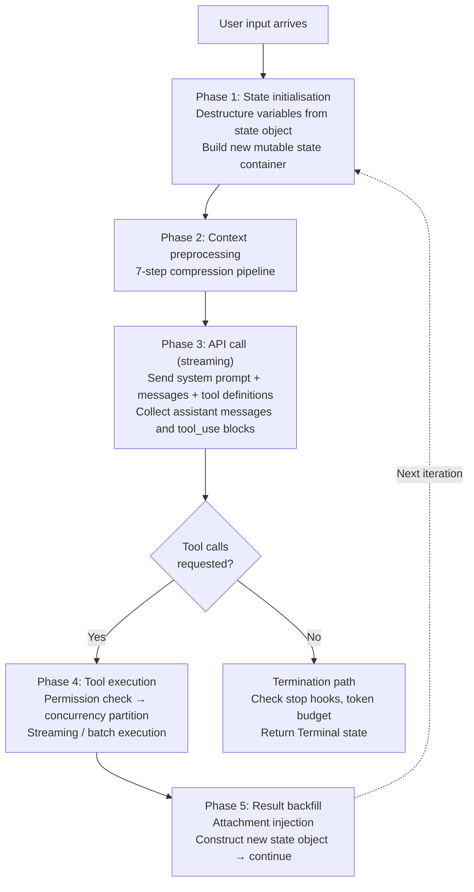
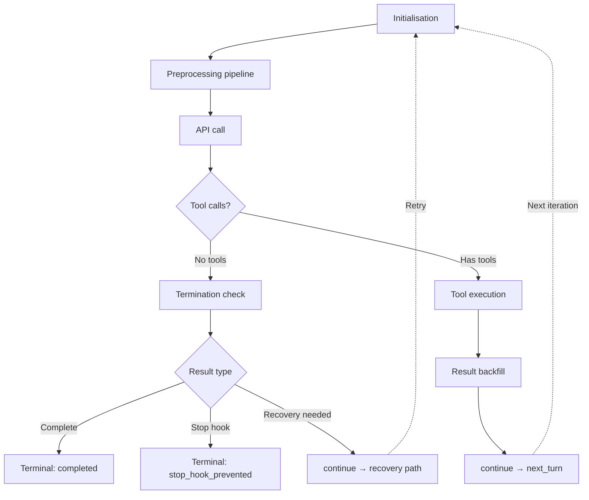

## Async generators: the skeleton of the dialog loop

Claude Code's dialog main loop is defined as `async function*` — an async generator. It is not a function that executes to completion in a single shot. It is a living process that can be paused, resumed, and cancelled. Each `yield` is a heartbeat pulse, pushing a streaming event to the caller.

This is not a casual technology choice. Traditional LLM calls use a request-response pattern: send a prompt, wait for the complete response, process the result. But an agent breaks this assumption in three ways simultaneously:

- The model may take tens of seconds to complete a response, and responses arrive token by token.
- Tool execution may take minutes, and users need real-time progress feedback.
- The user may interrupt at any time and expect an immediate stop.

`AsyncGenerator` provides the answer to all three:

<CardGroup cols={2}>
  <Card title="Incremental output" icon="activity">
    `yield` pushes each streaming event to the caller as it is produced. The UI layer renders each event immediately; the user does not wait for the entire response to complete.
  </Card>
  <Card title="Cancellability" icon="square">
    The caller can terminate the generator at any time via `generator.return()`. This triggers the `finally` block deterministically, releasing resources and cancelling in-flight tool calls.
  </Card>
  <Card title="Backpressure control" icon="gauge">
    If the consumer (UI layer) cannot keep up with the producer (dialog loop), the generator pauses automatically. When tool execution produces large volumes of output, memory does not accumulate unboundedly.
  </Card>
  <Card title="Type safety" icon="shield-check">
    The yielded event type is a discriminated union. The compiler knows every possible event shape at the call site. No stringly-typed event names, no unhandled variants.
  </Card>
</CardGroup>

<Note>
Callbacks produce callback hell as event types multiply. Promise chains lose mid-stream cancellability. RxJS Observables are powerful but introduce a heavy dependency and steep learning curve. `AsyncGenerator` is the only approach that satisfies streaming, cancellability, and type safety simultaneously with zero extra dependencies.
</Note>

### The five yield event types

The events flowing through the dialog loop form the "heartbeat signals" of the entire conversation. The generator's yield type is a discriminated union of five event shapes:

<AccordionGroup>
  <Accordion title="stream_request_start" icon="play">
    Emitted at the beginning of each loop iteration, before the API request begins. This event tells the UI layer that a new model request is about to be made — the practical effect is that the UI can display a "thinking..." status indicator. It fires once per iteration of the `while(true)` loop, giving the UI a reliable signal for each round-trip to the model.
  </Accordion>
  <Accordion title="StreamEvent" icon="radio">
    Raw streaming events from the Anthropic API: text block deltas (`content_block_delta`), thinking blocks, `tool_use` blocks, and more. These events are passed through directly from the API response stream to the UI — like frames in a live video stream. The UI stitches them into smooth, incremental rendering.
  </Accordion>
  <Accordion title="Message" icon="message-square">
    Structured message objects, parsed and typed. Subtypes include `AssistantMessage` (text plus optional `tool_use` blocks), `UserMessage` (user input or `tool_result` blocks), `SystemMessage` (system notifications such as permission changes or model fallback prompts), `AttachmentMessage` (file change notifications, CLAUDE.md contents), and `ProgressMessage` (real-time tool execution feedback). Unlike `StreamEvent`, messages are fully parsed — the structured replay after the live broadcast.
  </Accordion>
  <Accordion title="TombstoneMessage" icon="archive">
    When a streaming fallback occurs and the model switches strategies, previously produced messages may be invalidated. A `TombstoneMessage` tells the UI to remove the corresponding historical entries from the display. The name is deliberate: just as a tombstone marks the end of a life, a `TombstoneMessage` marks a message's invalidation.
  </Accordion>
  <Accordion title="ToolUseSummaryMessage" icon="list">
    After a batch of tool executions completes, an asynchronously generated brief summary is yielded for collapsed display in the UI. Without summaries, the complete output from dozens of tool calls in a long agent session would overwhelm the screen. This event type enables the UI to render a compact, folded view of completed tool batches.
  </Accordion>
</AccordionGroup>

The caller consumes all five event types through a single `for await...of` loop. The union type forces exhaustive handling — there is no implicit "other" category.

---

## The lifecycle of a complete turn

The `queryLoop` function is a `while(true)` infinite loop. Each iteration represents one complete round of "model call + optional tool execution." Follow a single iteration from the user pressing Enter to the model completing its response:



### Phase 1: state initialisation

At the top of every iteration, the loop destructures the variables it needs from the immutable state object — message list, tool usage context, auto-compaction tracking, recovery counters, turn count, and the reason for the last continue. This is a snapshot read: all reads for this iteration happen at once, before any mutations can occur.

At the end of the iteration, an updated state object is constructed wholesale and `continue` jumps to the top of the loop. There is a strict boundary between "read" (snapshot at start) and "write" (atomic replacement at end). Partial updates mid-iteration are structurally impossible.

### Phase 2: the seven-step context preprocessing pipeline

Before calling the model, the loop executes a carefully ordered series of compression steps. The guiding principle is: **arrange compression methods from lightweight to heavyweight, and try the lowest-cost approach first.**

<Steps>
  <Step title="Tool result budget">
    Overly large tool results are truncated or persisted to disk, ensuring the context window limit is not exceeded before the pipeline begins. This is the paging mechanism of context management — when data is too large to fit in the "working memory" (context window), it is spilled to disk with only a summary retained.
  </Step>
  <Step title="Snip compression">
    If history trimming is enabled, excessively long history messages are truncated directly. Snip is the most aggressive content-level compression — it is typically triggered by extremely long tool output such as the full contents of a large file.
  </Step>
  <Step title="Microcompact">
    Lightweight compression performed before auto-compaction, using cached editing techniques to reduce token consumption while reusing tokens already cached on the API side. Microcompact is designed to be cache-friendly — it avoids the complete cache invalidation that naive compression would cause.
  </Step>
  <Step title="Context collapse">
    A fine-grained strategy that collapses consecutive messages into a compact view without information loss. Think of it as folding short acknowledgements ("okay", "I understand") in a conversation into a single line — the information is preserved, but it occupies less space.
  </Step>
  <Step title="System prompt assembly">
    The base system prompt is merged with dynamic context (current working directory, user configuration, etc.) into the final system prompt. The assembly order is deterministic — stable byte content is essential for prompt cache hits.
  </Step>
  <Step title="Autocompact">
    If the context exceeds a threshold, the auto-compaction mechanism summarises the conversation history into a compressed message and replaces the message list. This is the last line of defence — used only when all lighter compression methods have failed to bring the context within budget.
  </Step>
  <Step title="Token block check">
    If the token count still exceeds a hard limit after all previous steps, an error message is returned immediately without making an API call. This fail-fast mechanism prevents sending a request that is guaranteed to fail.
  </Step>
</Steps>

### Phase 3: API call

After preprocessing, the loop sends the assembled messages, system prompt, and tool definitions to the model as a streaming request. The response arrives as a stream of events. For each event received:

- If it contains an assistant message, it is added to the assistant message array.
- If it contains `tool_use` blocks, they are collected and a flag is set that tool execution is needed.
- If streaming tool execution is enabled, tools are dispatched **immediately** upon receiving their `tool_use` block — without waiting for the entire response to complete.

A subtlety: the model may mix text and tool calls in a single response. It might output "Let me check your package.json" and then append a Read tool call. The loop correctly handles this mixed output — yielding text events for UI rendering while simultaneously collecting tool call blocks for execution.

### Phase 4: tool call execution

If the model requested tool calls, the loop executes them. Depending on whether streaming execution is enabled, it either collects remaining results from the `StreamingToolExecutor` or runs the traditional batch execution function.

Tool execution is itself an async generator. For each result message produced, the loop yields it to the upper-level consumer (the UI) *and* collects it into the tool results array for the next API call. Result collection and result presentation are decoupled — they are accomplished simultaneously through the same `yield` operation, with no additional state synchronisation required.

### Phase 5: result backfill and next round

After tool execution, the loop performs **attachment injection** — injecting memory files (CLAUDE.md), file change notifications, and queued commands into the message list. This ensures that at the start of the next iteration, the model has the latest environment information. If the user modified CLAUDE.md during tool execution, the model will see the updated configuration in the next round.

All messages — original messages, assistant messages, and tool results — are packaged into a new state object. `continue` returns to the top of the `while(true)` loop. The next iteration presents the model with a complete view of what just happened.

---

## The ten termination reasons

The dialog loop terminates at multiple points. Each termination reason carries distinct cleanup logic and diagnostic meaning:

<Tabs>
  <Tab title="Normal">
    | Reason | Trigger condition |
    |--------|-------------------|
    | `completed` | Model responds with no tool calls — the agent has finished the task. This is the only "successful completion" path. |
  </Tab>
  <Tab title="User-initiated">
    | Reason | Trigger condition |
    |--------|-------------------|
    | `aborted_streaming` | User presses Ctrl+C during model output. The loop stops immediately, the generator's `finally` block fires. |
    | `aborted_tools` | User interrupts during tool execution. The current tool is cancelled and its results are discarded. |
  </Tab>
  <Tab title="Abnormal">
    | Reason | Trigger condition |
    |--------|-------------------|
    | `max_turns` | Maximum loop iteration count reached. Prevents infinite loops consuming tokens. |
    | `blocking_limit` | Token count exceeds a hard limit. All compression methods have been applied; further progress is impossible. |
    | `prompt_too_long` | Context is too long and all recovery attempts have failed. |
    | `model_error` | API call threw an exception. Graceful degradation for network or server issues. |
    | `stop_hook_prevented` | A stop hook prevented the loop from continuing. The user configured an auto-stop condition that triggered. |
    | `hook_stopped` | A tool hook prevented continuation. An external hook script decided to stop the loop. |
    | `image_error` | An image in the input has an invalid size or format. |
  </Tab>
</Tabs>

<Info>
The fine-grained classification of ten termination reasons is not over-engineering. When debugging agent behaviour, the accurate termination reason is the first diagnostic clue. A generic "error" return would make it impossible to distinguish an API timeout from a context overflow from a user interrupt.
</Info>

For all abnormal terminations, the loop performs cleanup before returning the terminal state: cancelling in-flight tools, releasing resource references, and logging the termination reason. Even an unexpected exit leaves no "dirty" state behind.

---

## The seven continue paths

When the model requests tool calls or encounters a recoverable condition, the loop continues rather than terminates. Each continue path constructs a new `State` object and records the reason in the `transition` field — enabling subsequent iterations to identify how they arrived at the current state:

| Continue path | When it triggers | What it does |
|---------------|-----------------|--------------|
| `next_turn` | Tool calls completed normally | Expands the message list with assistant messages and tool results; increments the turn count. The most common path. |
| `max_output_tokens_escalate` | First occurrence of model output truncation | Attempts to increase the output token limit, giving the model more space to finish in a single response. |
| `max_output_tokens_recovery` | Subsequent truncation after escalation | Injects a recovery message instructing the model to continue from the truncation point. Maximum 3 retries. |
| `reactive_compact_retry` | Context too long after all preventive compression | Triggers reactive compaction as a last resort. If compaction fails, the loop terminates. |
| `collapse_drain_retry` | Context collapse overflow recovery | Executes before reactive compaction because collapse preserves finer-grained context (minimum information loss). |
| `stop_hook_blocking` | Stop hook returns a blocking error | Injects the hook's error message into the message list and continues — giving the model a chance to correct its strategy. |
| `token_budget_continuation` | Token budget management trigger | Injects a reminder message alerting the model about remaining budget. The loop continues; this is a warning, not a termination. |

<Tip>
Recording the reason for each `continue` is a simple but extremely effective debugging technique. When agent behaviour is abnormal, tracing the transition chain — the sequence of `transition` field values across iterations — identifies exactly which path introduced the problem.
</Tip>

---

## The QueryDeps dependency injection pattern

One of the most significant engineering decisions in the dialog loop is its dependency injection model. The loop defines a minimal `QueryDeps` interface containing four core injectable dependencies:

```typescript
interface QueryDeps {
  callModel:    (params: ...) => AsyncGenerator<StreamEvent>
  microcompact: (messages: Message[]) => Promise<Message[]>
  autocompact:  (messages: Message[]) => Promise<Message[]>
  uuid:         () => string
}
```

These four dependencies cover exactly the loop's "boundary points of interaction with the external world": the model API call, the two compression functions, and UUID generation. Abstracting them behind an interface turns the loop's internal logic into pure, testable state machine code.

The production implementation returns real API calls, real compression logic, and cryptographically random UUIDs. During testing, callers pass in custom implementations:

```typescript
// Test: inject a fake model that always returns truncated output
const fakeDeps: QueryDeps = {
  callModel: async function* () {
    yield { type: 'assistant', content: 'Partial resp', stop_reason: 'max_tokens' }
  },
  microcompact: async (msgs) => msgs,
  autocompact:  async (msgs) => msgs,
  uuid:         () => 'test-uuid-001',
}
```

Without dependency injection, tests must intercept module-level imports via spy/mock. This coupling creates several maintenance problems:

- Test code is tied to module internal structure; renaming a module breaks tests.
- The same mock boilerplate is duplicated across every test file that needs it.
- Module caching can cause state to leak between test runs.

Dependency injection eliminates all three problems: tests pass a custom object without caring about module internals; each test case creates an independent dependency instance; the interface is explicit, and the compiler flags tests that need updating when the interface changes.

### Why a function, not a class

The dialog loop chooses `async function*` over a class method. This has deep reasoning:

<CardGroup cols={2}>
  <Card title="Natural state isolation" icon="box">
    Each call to the dialog function creates a fresh closure. All mutable state is local to that invocation. Multiple concurrent dialog instances cannot accidentally share properties, eliminating an entire class of state pollution bugs.
  </Card>
  <Card title="Generator backpressure" icon="gauge">
    `yield` pauses execution until the consumer requests the next value. If the UI layer falls behind, the generator pauses automatically. A system without backpressure can crash when tool execution produces large volumes of output.
  </Card>
  <Card title="Deterministic cancellation" icon="square">
    `generator.return()` triggers the `finally` block. Combined with resource management, cleanup is deterministic. When the user presses Ctrl+C, not only is the loop stopped — all executing tools are cancelled and all temporary resources are released.
  </Card>
  <Card title="Composability via yield*" icon="layers">
    The `yield*` delegation syntax forwards sub-generator output directly. The dialog loop delegates to sub-generators for tool execution; the outer UI layer sees a single unified event stream from a single `for await...of` loop.
  </Card>
</CardGroup>

<Warning>
Avoid storing dialog state in global variables or class instance properties. Global state makes concurrent testing impossible. Class instance state allows multiple dialog instances to interfere with each other. Function closures are the safest state container — naturally isolated and naturally unshareable.
</Warning>

---

## State transition model

The loop's complete state machine is driven by two types: `State` (the mutable-but-controlled data container) and the union of `Continue` and `Terminal` signals.

`State` carries: message list, tool usage context, auto-compaction tracking, output token recovery counter, whether reactive compression has been attempted, output token override limit, pending tool summaries, stop hook activation flag, turn count, and the `transition` field recording the reason for the last continue.

The `transition` field is the state machine's "breadcrumb trail." When the loop arrives at a new iteration, it knows not just the current state but the path that led there. This enables recovery logic to avoid re-executing the same recovery path — for example, `max_output_tokens_escalate` will not run again if the `transition` field shows it already ran in the previous iteration.



The elegance of the three-element model (`State` + `Continue` + `Terminal`) is that the type system enforces loop correctness. `State` is immutable between the snapshot read at the start of an iteration and the atomic write at its end. `Continue` carries the reason and any additional information needed to guide the next iteration. `Terminal` carries the reason for ending and is never continued from — the compiler ensures a `Terminal` result is returned to the caller, not passed back into the loop.
