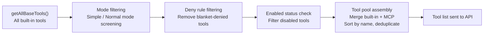
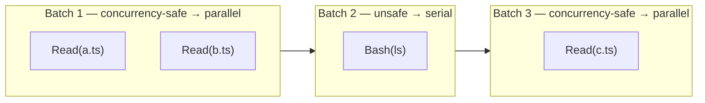
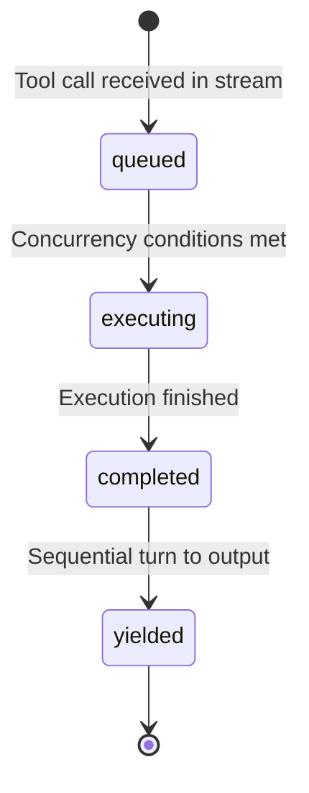

## The tool definition protocol

Every tool in Claude Code follows a unified type contract: `Tool<Input, Output, Progress>`. This contract is defined in the tool type core module and serves as the cornerstone of the entire tool system.

The design philosophy is **"interface as architecture"**: by defining strict type interfaces, all architectural constraints of the tool system — permission checks, concurrency control, progress reporting, UI rendering — are enforced by the compiler. Developers cannot forget to implement a required method; the type checker raises an error immediately.

### The three generic parameters

```typescript
type Tool<
  Input extends AnyObject,    // Zod-validated input
  Output,                      // Free-form output type
  P extends ToolProgressData   // Streaming progress data
>
```

The separation of the three parameters is deliberate. Merging input and output would make tool signatures harder to read. Omitting the progress type would prevent tools from providing real-time feedback during long-running operations. Separating all three gives each concern its own type space, and the compiler checks them independently.

### The five elements every tool must implement

<Steps>
  <Step title="Name and aliases">
    Each tool has a unique primary name identifier. Aliases support backward compatibility: when a tool is renamed, the old name continues to match through the alias system. The tool lookup function checks both the primary name and all aliases.

    The alias mechanism reflects a universal engineering principle: **in public APIs, renaming is an "add-only" operation.** Even when a tool's name is no longer accurate — for example, renaming `SearchTool` to `GrepTool` — the old name must remain valid through an alias, otherwise configurations, scripts, and user habits that depend on it all break.
  </Step>

  <Step title="Zod schema">
    Each tool defines its input parameters using a Zod schema. The schema serves a dual purpose:

    - **Runtime validation** — before tool execution, parameters generated by the LLM are parsed through Zod with strict structural validation. This is the "don't trust external input" principle: LLM output is uncontrollable, and tools must protect themselves.
    - **API communication** — the Zod schema is converted into a JSON Schema that is sent to the API, letting the model know the meaning and constraints of each parameter.

    This means the Zod schema is the tool's "user manual." The parameter descriptions the model sees come from `.describe()` calls in the Zod schema — the same source of truth that provides runtime type safety.
  </Step>

  <Step title="Permission model">
    Three permission-related methods form a layered check pipeline:

    1. **`validateInput`** — runs before permission checks to reject invalid inputs. This is a data legitimacy check, independent of permission policy.
    2. **`hasPermissionsToUseTool` + `checkPermissions`** — tool-specific permission logic. The Read tool may only check whether a path is in an allow list; BashTool parses commands and assesses risk levels.
    3. **Runtime property methods** — `isConcurrencySafe()`, `isReadOnly()`, `isDestructive()` — affect scheduling strategy and the overall permission pipeline.

    The three-layer separation enforces separation of concerns: data validation does not care about permission policies; permission policies do not care about concurrency scheduling.
  </Step>

  <Step title="Execution logic">
    The core `call` method receives parsed input parameters, the tool use context, a permission check callback, a parent message reference, and an optional progress callback. The returned result carries output data and an optional `contextModifier`.

    The `contextModifier` is the key channel for tools to influence subsequent behaviour. `FileWriteTool` updates the file state cache through `contextModifier` after writing, so subsequent `FileReadTool` invocations see the latest file contents. Without this channel, tools would have no principled way to communicate side effects to the rest of the system.
  </Step>

  <Step title="UI rendering">
    Tools provide a complete set of rendering methods covering the full lifecycle of a tool call:

    | Method | When it fires |
    |--------|--------------|
    | `renderToolUseMessage` | Tool call starts ("Reading src/foo.ts") |
    | `renderToolUseProgressMessage` | During execution — streaming output, partial results |
    | `renderToolResultMessage` | Execution completed successfully |
    | `renderToolUseRejectedMessage` | Permission denied |
    | `renderToolUseErrorMessage` | Execution encountered an error |
    | `renderGroupedToolUse` | Multiple parallel tools shown as a group |

    Each method returns `React.ReactNode`, enabling deep integration with the React/Ink rendering pipeline. Progress bars, colour highlighting, collapsible panels, and table layouts are all available — fundamentally the same component model used in web applications.
  </Step>
</Steps>

### The `buildTool()` fail-safe factory

`buildTool` is the standard factory function for creating tools. It accepts a partial tool definition and fills in safe default values. These defaults follow the **fail-closed principle**: security-related methods default to `false`, requiring tools to explicitly declare themselves safe before enjoying optimisations like concurrency.

```typescript
// Minimal tool definition — only the essentials
const MyReadTool = buildTool({
  name: 'MyRead',
  description: 'Read a file and return its contents.',
  inputSchema: z.object({
    path: z.string().describe('Absolute path to the file'),
  }),
  async call({ path }) {
    const content = await fs.readFile(path, 'utf-8')
    return { content }
  },
  isReadOnly: () => true,         // explicit safe declaration
  isConcurrencySafe: () => true,  // explicit safe declaration
})
```

The airport security analogy is apt: the default assumption is that all luggage needs inspection (fail-closed). Only passengers with explicit certification can use the fast lane. If the default were pass-through (fail-open), any missed check could cause a security incident.

The type system uses clever conditional type computation: if a developer provides a particular method, the type system uses the developer's signature; if omitted, the safe default is used. Simple tools need only a few lines; complex tools can override every element.

---

## Tool registration and dynamic discovery

### `getAllBaseTools()` — the complete tool inventory

Claude Code registers 45+ built-in tools across 12 functional categories:

<Tabs>
  <Tab title="File & search">
    | Tool | Responsibility | Concurrency safe |
    |------|---------------|-----------------|
    | `FileReadTool` | Read file contents; maintains a file state cache | Yes |
    | `FileEditTool` | Precise `old_string → new_string` replacement | No |
    | `FileWriteTool` | Create or completely overwrite files | No |
    | `GlobTool` | Filename pattern matching via `fast-glob` | Yes |
    | `GrepTool` | Content search via `ripgrep` | Yes |
    | `NotebookEditTool` | Jupyter Notebook cell editing | No |
  </Tab>
  <Tab title="Execution & web">
    | Tool | Responsibility | Concurrency safe |
    |------|---------------|-----------------|
    | `BashTool` | Run shell commands with AST-level semantic analysis | No |
    | `WebFetchTool` | Fetch and parse URL content | Yes |
    | `WebSearchTool` | Web search with structured results | Yes |
  </Tab>
  <Tab title="Agent & task">
    | Tool | Responsibility | Concurrency safe |
    |------|---------------|-----------------|
    | `AgentTool` | Spawn sub-agents for parallel subtasks | No |
    | `TodoWriteTool` | Task list management | Varies |
    | `TaskCreateTool` | Create structured tasks | Varies |
    | `AskUserQuestionTool` | Request user input interactively | No |
  </Tab>
  <Tab title="Planning & config">
    | Tool | Responsibility | Concurrency safe |
    |------|---------------|-----------------|
    | `EnterPlanModeTool` | Switch to read-only plan mode | No |
    | `ExitPlanModeV2Tool` | Exit plan mode | No |
    | `ConfigTool` | Modify Claude Code configuration | No |
    | `SkillTool` | Invoke declarative Markdown skills | No |
  </Tab>
  <Tab title="MCP & system">
    | Tool | Responsibility | Concurrency safe |
    |------|---------------|-----------------|
    | `ListMcpResourcesTool` | List MCP server resources | Yes |
    | `ReadMcpResourceTool` | Read an MCP resource | Yes |
    | `EnterWorktreeTool` | Switch to a Git worktree | No |
    | `ExitWorktreeTool` | Exit a Git worktree | No |
    | `BriefTool` | Send notification messages | No |
    | `ToolSearchTool` | Deferred tool schema discovery | Yes |
  </Tab>
</Tabs>

<Note>
More than half of all tools are marked concurrency-unsafe. This reflects a fundamental reality of agent systems: most operations have side effects — modifying files, executing commands, changing state. Operations that can safely execute in parallel (pure reads, pure searches) are in the minority. The concurrency partitioning algorithm's core challenge is maximising parallelism within this constraint.
</Note>

### Dead code elimination via conditional registration

Claude Code's tool registration uses conditional imports to achieve compile-time dead code elimination:

```typescript
// Simplified illustration of conditional registration
const tools = [
  ...getBaseTools(),
  ...(IS_INTERNAL_BUILD ? [REPLTool, DebugTool] : []),
  ...(featureFlags.TASK_SCHEDULING ? [TaskSchedulerTool] : []),
]
```

Feature flags come from the build toolchain and are evaluated by the bundler at compile time. When a flag is off, the corresponding tool implementation is removed by tree-shaking. External builds never contain internal tool code — not just disabled, but physically absent.

This has significant security implications: if internal tools were included in external builds, even as dead code, they would leak internal architecture information. Compile-time elimination removes this information leakage risk at the source.

### `ToolSearchTool` — deferred tool discovery

When the number of registered tools exceeds a threshold (especially after MCP extension), Claude Code enables deferred discovery. Instead of sending the complete schema of every tool in the initial system prompt, it sends only the tool name list and lets the model load detailed schemas on demand through `ToolSearchTool`.

The traditional approach is like placing an entire encyclopaedia in front of the model — most of it unused in any given conversation. Deferred discovery is like providing a table of contents index: the model knows what tools are available and opens the relevant page only when needed.

Logic for determining whether a tool should be deferred:
- Tools explicitly marked `alwaysLoad` are included in the initial prompt.
- MCP tools are always deferred.
- `ToolSearchTool` itself is never deferred.

<Tip>
If you are building an agent system with external tools connected via MCP, pay close attention to tool schema token consumption. Each schema includes name, description, and parameter definitions. With 50+ tools, the total can reach tens of thousands of tokens. Deferred discovery is an effective optimisation strategy.
</Tip>

### The tool filtering pipeline

From `getAllBaseTools()` to the final list sent to the API, four filtering stages apply:



Sorting by name before sending is not cosmetic — it ensures **prompt cache stability**. Changes in tool order would produce different byte content in the system prompt, invalidating the API-side prompt cache. Deterministic ordering is essential for cache-aware design.

---

## Core tools in depth

### BashTool — the Swiss Army knife

BashTool is both the most powerful and the most complex tool in the system. It is not a simple shell executor; it is an execution environment with multiple layers of protection.

<AccordionGroup>
  <Accordion title="Error propagation" icon="alert-triangle">
    When a BashTool execution fails, all parallel Bash tool calls in the same batch are cancelled. Shell commands often have implicit dependency chains — if `mkdir` fails, subsequent commands writing to that directory are meaningless. Fail fast rather than let downstream commands execute in a corrupted environment.
  </Accordion>
  <Accordion title="Interrupt behaviour" icon="square">
    BashTool can customise its behaviour when the user interrupts. Long-running commands such as test suites may choose to block rather than cancel — the user may want to see the current progress rather than discard the results entirely.
  </Accordion>
  <Accordion title="Semantic analysis" icon="code">
    BashTool performs AST parsing on commands to determine whether a command is a search/read operation (`isSearchOrReadCommand`), used for UI collapsible display decisions. Tools are not passive pipelines; they understand command semantics and make corresponding UI decisions.
  </Accordion>
  <Accordion title="Sandbox integration" icon="shield">
    The `--dangerouslyDisableSandbox` parameter controls the security boundary of command execution. Even in bypass permission mode, the sandbox can restrict a command's file system access scope — a last line of defence independent of the permission pipeline.
  </Accordion>
</AccordionGroup>

### The file trio: Read, Edit, Write

The three file tools constitute Claude Code's complete file operation capability set, following a deliberate division of scope:

<CardGroup cols={2}>
  <Card title="FileReadTool" icon="file-text">
    Reads file contents and maintains a file state cache to track which files have been read. Avoids duplicate memory attachment injection. Marked concurrency-safe — multiple reads can proceed in parallel.
  </Card>
  <Card title="FileEditTool" icon="edit">
    Precise `old_string → new_string` exact replacement. **Why not line numbers?** Line numbers are fragile — if another tool modifies the file between read and edit, line numbers shift. String matching is idempotent: as long as the target fragment exists unchanged, the edit is safe.
  </Card>
  <Card title="FileWriteTool" icon="file-plus">
    Creates or completely overwrites files. The "heaviest" file operation, with the strictest permission checks. `contextModifier` updates the file state cache after writing, so subsequent Read invocations see the latest contents.
  </Card>
  <Card title="Design principle" icon="layers">
    No Delete tool is deliberately provided. Deleting files is an irreversible operation, handled through BashTool's `rm` command which triggers stricter permission checks. **Prefer Edit over Write, prefer Read over Bash** — least privilege at the tool selection level.
  </Card>
</CardGroup>

### The search duo: Glob and Grep

`GlobTool` uses `fast-glob` for filename pattern matching. `GrepTool` uses `ripgrep` for content search. Both are marked concurrency-safe.

Although BashTool can replicate their functionality through `find` and `grep` shell commands, dedicated search tools have three advantages:

1. **Structured output** — search tools return typed result lists, not raw shell text. The model parses structured data more accurately.
2. **Lenient permissions** — read-only tools face less friction in the permission pipeline. Routing every search through BashTool would trigger more user confirmation prompts.
3. **Performance** — dedicated tools can apply result-count limits, parallel search strategies, and other optimisations not available in shell commands.

### AgentTool — the sub-agent entry point

`AgentTool` allows the primary agent to spawn sub-agents that handle subtasks in their own independent context windows. Several special properties:

- Marked `alwaysLoad` — remains visible even when `ToolSearchTool` deferred discovery is active. Sub-agent capability is too critical to hide.
- Sub-agents are created with independent `ToolUseContext` instances via `createSubagentContext`, inheriting some state from the parent (permission rules) but with independent message lists.
- Sub-agent results surface to the primary agent through `TaskOutputTool`.

The "inherit but don't share" pattern ensures sub-agents cannot accidentally modify the parent agent's state.

---

## The tool orchestration engine

The orchestration engine is the "command centre" of the tool system. It determines how multiple simultaneous tool calls are scheduled, executed, and collected. A good orchestration engine must balance three objectives: **parallelism** (execute in parallel as much as possible), **safety** (avoid data races), and **ordering** (results arrive in the same order as requests).

### `runTools()` and the concurrency partitioning algorithm

The scheduling strategy is based on **greedy concurrency partitioning**:

1. Iterate through all tool calls in the order they were requested.
2. If the current tool is concurrency-safe and the previous batch is also concurrency-safe, merge it into the same batch.
3. Otherwise, start a new batch.
4. Execute concurrency-safe batches in parallel; execute unsafe batches serially.

Example: `[Read(a.ts), Read(b.ts), Bash(ls), Read(c.ts)]`



Why can't `Read(c.ts)` be in the same batch as `Read(a.ts)` and `Read(b.ts)`? Because `Bash(ls)` separates them — and Bash commands may create files, modify contents, or change directory structures. `Read(c.ts)` must see the deterministic state after `Bash(ls)` has completed.

The parallel execution concurrency limit defaults to 10, controlled by an environment variable.

### `StreamingToolExecutor` — zero-wait execution

`StreamingToolExecutor` enhances `runTools` by starting tool execution **immediately** as `tool_use` blocks arrive in the model's streaming response — without waiting for the full response to complete.

**The performance impact is significant.** Suppose the model requests five tool calls, each taking 1 second to execute:

- **Traditional mode**: 2 seconds (model response) + 5 seconds (sequential tool execution) = **7 seconds total**
- **Streaming mode**: first tool starts ~0.4 seconds after model output begins; subsequent tools start in sequence; **~3 seconds total** — more than 50% faster

Each tracked tool passes through a four-stage state machine:



| State | Description |
|-------|-------------|
| `queued` | Tool call received; waiting for execution conditions |
| `executing` | Currently running — allowed only when no tools are executing, or all executing tools are concurrency-safe |
| `completed` | Results collected; waiting for sequential turn to be yielded to the upper layer |
| `yielded` | Result yielded to the caller; lifecycle ends |

Five key design decisions of `StreamingToolExecutor`:

<AccordionGroup>
  <Accordion title="Order guarantee" icon="list-ordered">
    Even though tools can complete in parallel, results are yielded in the same order as the requests. When traversing the tool list to collect completed results, the function stops at the first incomplete non-safe tool. This preserves a deterministic ordering guarantee for upper-layer processing logic.
  </Accordion>
  <Accordion title="Error propagation" icon="alert-triangle">
    BashTool failures cancel all parallel sibling tools — Bash errors typically indicate environment-level problems (disk full, network down) that would cause other commands to fail anyway. Non-Bash tool errors do not propagate — Read and search failures are usually localised and do not affect other concurrent operations.
  </Accordion>
  <Accordion title="Immediate progress yielding" icon="activity">
    Progress messages bypass the ordering constraint and are yielded to the UI immediately. Users see real-time feedback from running tools without waiting for preceding tools to complete. Progress messages are "informational"; result messages are "factual" and must maintain order.
  </Accordion>
  <Accordion title="Discard mechanism" icon="trash">
    When a streaming fallback occurs — the model switches to a fallback strategy — all pending and executing tools are marked discarded, preventing stale results from leaking into the next model call. This is an emergency brake: when the model changes strategy, all tool results based on the old strategy are invalidated.
  </Accordion>
  <Accordion title="Hierarchical cancellation signals" icon="shield">
    Each tool execution uses an independent sub-cancellation controller, forming a hierarchical cancellation signal chain. Errors from sibling tools or user Ctrl+C propagate to the correct tools without accidentally cancelling unrelated operations.
  </Accordion>
</AccordionGroup>

<Warning>
Avoid using a single `AbortController` to manage all tool cancellations. When Tool A fails and needs to cancel Tool B, it should not simultaneously cancel the unrelated Tool C. Hierarchical cancellation signals are the correct design.
</Warning>

### Integration with the dialog loop

Tool execution integrates tightly with the dialog main loop's phases 3 and 4:

- **Streaming execution path** — a `StreamingToolExecutor` is created alongside the API call. As `tool_use` blocks arrive in the response stream, tools are dispatched immediately. Results from already-completed tools are yielded while the model is still generating its response.
- **Batch execution path** — when streaming execution is unavailable, the traditional `runTools` function executes all tools after the model's response has fully completed. This is the fallback that ensures correct behaviour even when streaming is disabled.
- **Context propagation** — after execution, `contextModifier` updates (file cache updates, directory state changes) propagate back to the dialog loop, affecting the execution environment of subsequent tool calls.

---

## The tool system as extensibility architecture

The generic design of `Tool<Input, Output, Progress>` gives each tool its own type space while `ToolUseContext` provides a unified execution environment. Adding a new tool requires no modification to the orchestration engine — the engine operates on the `Tool` interface, not on concrete implementations.

This is the "progressive capability extension" principle from Chapter 1 realised at the tool system level. The architecture supports four extension levels — Tool, Skill, Plugin, and MCP Server — and the type contract is what makes each level composable with the others.

```typescript
// The entire tool registration contract is a single function returning Tool[]
// The orchestration engine only ever sees this interface
function getAllBaseTools(): Tool<AnyObject, unknown, ToolProgressData>[]
```

Any tool that satisfies the five-element protocol — name, schema, permissions, execution, rendering — is schedulable, permission-checkable, and renderable by the existing infrastructure. New capabilities extend the agent without touching the harness.
